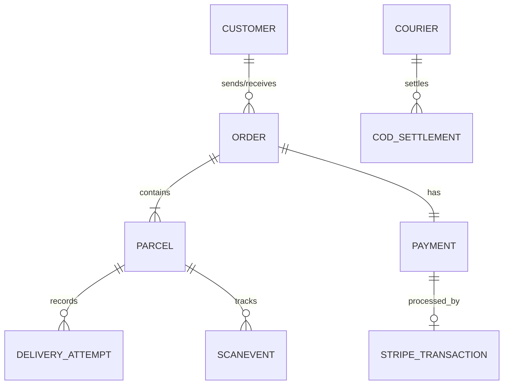

# Entity-Relationship Diagram (ERD)

This document describes the PostgreSQL data model, aligned with the simplified NestJS microservice architecture, including payments, Stripe transaction tracking, COD settlements, and delivery attempts.

---

## Visual Diagram (Mermaid)

---

## 1. Entities & Fields

### CUSTOMER
| Field | Type | Description |
| :--- | :--- | :--- |
| `id` | uuid PK | Unique identifier of the customer. |
| `name_enc` | string | Full name, stored with field-level encryption (PII). |
| `phone_enc` | string | Phone number, field-level encrypted (PII). |
| `address_enc` | string | Full street address, field-level encrypted (PII). |
| `region_code` | string | Plaintext region code used by sortation engine. |

### ORDER
| Field | Type | Description |
| :--- | :--- | :--- |
| `id` | uuid PK | Unique identifier of the shipment order. |
| `sender_id` | uuid FK | References CUSTOMER who sends the order. |
| `recipient_id` | uuid FK | References CUSTOMER who receives the order. |
| `price_cents` | int | Locked price in minor units (cents) at creation. |
| `expected_delivery_at` | timestamp | Locked calculated ETA. |
| `status` | enum | Projections status (Draft, Created, Confirmed, etc.). |

### PARCEL
| Field | Type | Description |
| :--- | :--- | :--- |
| `id` | uuid PK | Unique identifier of an individual parcel. |
| `order_id` | uuid FK | Order this parcel belongs to. |
| `declared_weight_grams` | int | Weight declared by sender. |
| `actual_weight_grams` | int | Weight measured at hub inbound. |
| `direction` | enum | Forward or Reverse (RTS). |
| `state` | enum | Current status state machine. |

### DELIVERY_ATTEMPT
| Field | Type | Description |
| :--- | :--- | :--- |
| `id` | uuid PK | Unique identifier. |
| `parcel_id` | uuid FK | References PARCEL. |
| `attempt_number` | int | Delivery attempt number (1, 2, or 3). |
| `failure_reason` | string | Reason for delivery failure. |
| `created_at` | timestamp | Time of attempt. |

### PAYMENT
| Field | Type | Description |
| :--- | :--- | :--- |
| `id` | uuid PK | Unique identifier. |
| `order_id` | uuid FK | References ORDER. |
| `type` | enum | PREPAID_STRIPE, COD, POSTPAID. |
| `amount_cents` | int | Value. |
| `status` | enum | Unpaid, Paid, Awaiting_Settlement. |

### STRIPE_TRANSACTION
| Field | Type | Description |
| :--- | :--- | :--- |
| `id` | uuid PK | Unique identifier. |
| `payment_id` | uuid FK | References PAYMENT. |
| `stripe_intent_id` | string | Stripe PaymentIntent ID. |
| `stripe_charge_id` | string | Stripe Charge ID. |
| `status` | string | Stripe charge status. |
| `created_at` | timestamp | Transaction timestamp. |

### COD_SETTLEMENT
| Field | Type | Description |
| :--- | :--- | :--- |
| `id` | uuid PK | Unique identifier. |
| `courier_id` | uuid FK | References COURIER. |
| `total_collected_cents` | int | Cash amount collected. |
| `status` | enum | Pending, Settled. |
| `reconciled_at` | timestamp | Reconciled time. |

### SCANEVENT (Tracking Database)
| Field | Type | Description |
| :--- | :--- | :--- |
| `id` | uuid PK | Unique identifier (append-only). |
| `parcel_id` | uuid FK | Scanned parcel logical key. |
| `hub_id` | uuid FK | Hub where scan happened. |
| `event_type` | enum | Scan action (PICKUP, HUB_RECEIVE, etc.). |
| `created_at` | timestamp | Log timestamp. |

---

## 2. Relationships

| From | To | Cardinality | Meaning |
| :--- | :--- | :--- | :--- |
| CUSTOMER | ORDER | 1 : N | a customer sends/receives many orders |
| ORDER | PARCEL | 1 : N | an order contains one or more parcels |
| ORDER | PAYMENT | 1 : 1 | an order has one payment record |
| PAYMENT | STRIPE_TRANSACTION | 1 : 0..1 | processed by Stripe transaction |
| PARCEL | DELIVERY_ATTEMPT | 1 : N | a parcel has many delivery attempts |
| PARCEL | SCANEVENT | 1 : N | each parcel has many scan events |
| COURIER | COD_SETTLEMENT | 1 : N | a courier has many cash settlements |
