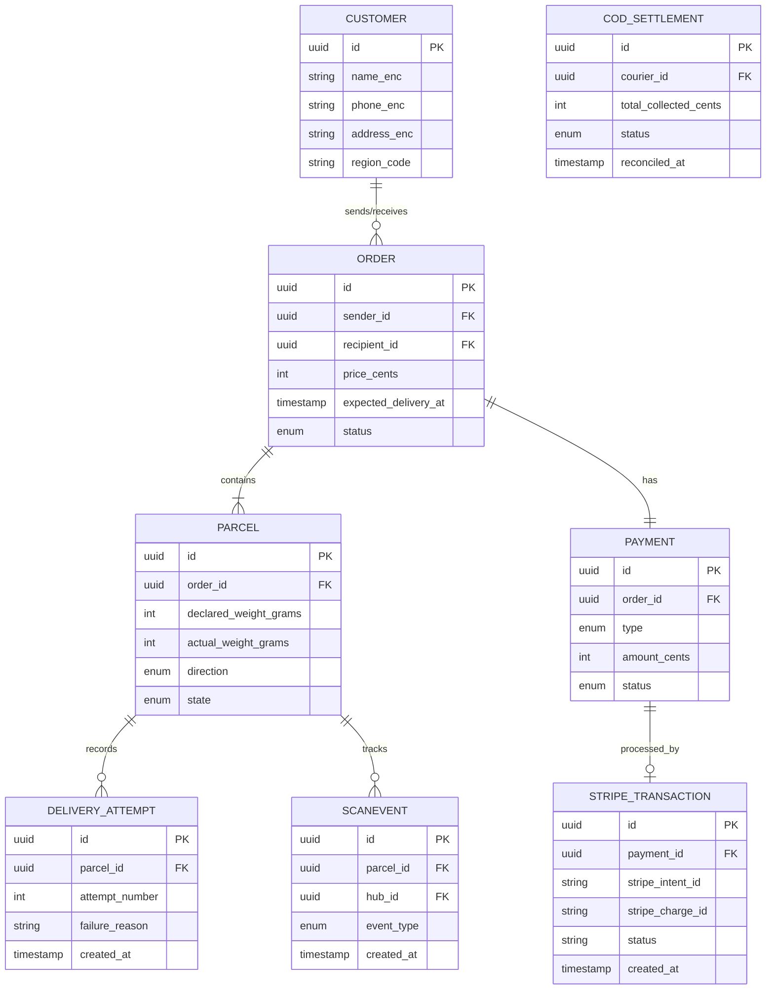

# Updated Entity-Relationship Diagram (ERD)

This document describes the updated PostgreSQL data model, aligned with the simplified NestJS microservice architecture, including payments, Stripe transaction tracking, COD settlements, and delivery attempts.

---

## Visual Diagram (Mermaid)

---

## 1. Entities

### CUSTOMER
*   `id` (UUID PK): Unique identifier.
*   `name_enc` (VARCHAR): Encrypted name (PII).
*   `phone_enc` (VARCHAR): Encrypted phone (PII).
*   `address_enc` (VARCHAR): Encrypted address (PII).
*   `region_code` (VARCHAR): Plaintext zone routing key.

### ORDER
*   `id` (UUID PK): Unique identifier.
*   `sender_id` (UUID FK): References `CUSTOMER`.
*   `recipient_id` (UUID FK): References `CUSTOMER`.
*   `price_cents` (INT): Locked cước phí.
*   `expected_delivery_at` (TIMESTAMP): Locked calculated ETA.
*   `status` (ENUM): Projections status (`Draft`, `Created`, `Confirmed`, `Awaiting_Pickup`, `Picked_Up`, `In_Transit`, `Delivered`, etc.).

### PARCEL
*   `id` (UUID PK): Unique identifier.
*   `order_id` (UUID FK): References `ORDER`.
*   `declared_weight_grams` (INT): Weight declared.
*   `actual_weight_grams` (INT, Nullable): Measured weight at hub inbound.
*   `direction` (ENUM): `Forward` or `Reverse` (RTS).
*   `state` (ENUM): Current status state machine.

### DELIVERY_ATTEMPT
*   `id` (UUID PK): Unique identifier.
*   `parcel_id` (UUID FK): References `PARCEL`.
*   `attempt_number` (INT): 1, 2, or 3.
*   `failure_reason` (VARCHAR): Detail (e.g. customer absent, rejected by recipient).
*   `created_at` (TIMESTAMP): Time of attempt.

### PAYMENT
*   `id` (UUID PK): Unique identifier.
*   `order_id` (UUID FK): References `ORDER`.
*   `type` (ENUM): `PREPAID_STRIPE`, `COD`, `POSTPAID`.
*   `amount_cents` (INT): Value.
*   `status` (ENUM): `Unpaid`, `Paid`, `Awaiting_Settlement`.

### STRIPE_TRANSACTION
*   `id` (UUID PK): Unique identifier.
*   `payment_id` (UUID FK): References `PAYMENT`.
*   `stripe_intent_id` (VARCHAR): Stripe PaymentIntent ID.
*   `stripe_charge_id` (VARCHAR): Stripe Charge ID.
*   `status` (VARCHAR): `succeeded`, `failed`, `pending`.
*   `created_at` (TIMESTAMP): Stripe event timestamp.

### COD_SETTLEMENT
*   `id` (UUID PK): Unique identifier.
*   `courier_id` (UUID FK): References `COURIER`.
*   `total_collected_cents` (INT): Verified cash amount.
*   `status` (ENUM): `Pending`, `Settled`.
*   `reconciled_at` (TIMESTAMP): Reconciled time.

### SCANEVENT (Tracking Database)
*   `id` (UUID PK): Unique identifier.
*   `parcel_id` (UUID FK): Logical key.
*   `hub_id` (UUID, Nullable): Location hub.
*   `event_type` (ENUM): Scan action (`PICKUP`, `HUB_RECEIVE`, `OUT_FOR_DELIVERY`, etc.).
*   `created_at` (TIMESTAMP): Log timestamp.

---

## 2. Entity Relationships (Crow's Foot Notation)

*   `CUSTOMER` has many `ORDER` (1 : N)
*   `ORDER` has many `PARCEL` (1 : N)
*   `ORDER` has one `PAYMENT` (1 : 1)
*   `PAYMENT` has one `STRIPE_TRANSACTION` (1 : 0..1)
*   `PARCEL` has many `DELIVERY_ATTEMPT` (1 : N)
*   `PARCEL` has many `SCANEVENT` (1 : N logical correlation)
*   `COURIER` has many `COD_SETTLEMENT` (1 : N)
