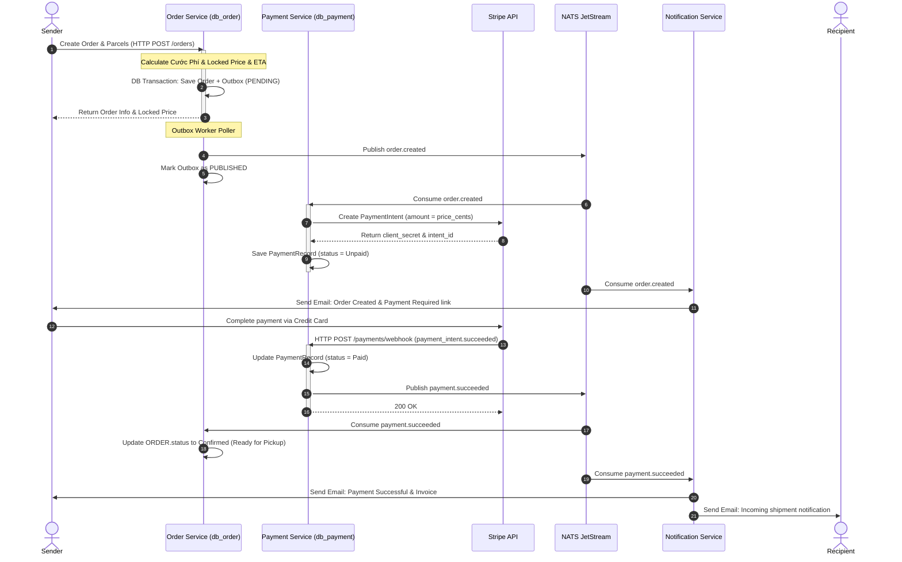
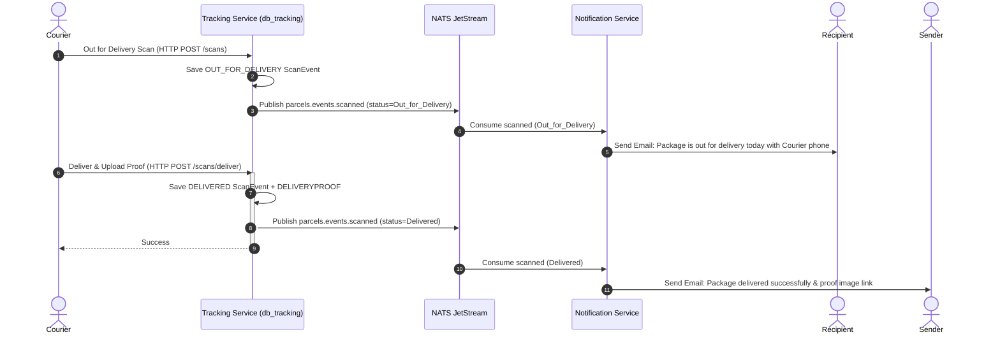

# Workflow Sequence Diagrams (Shipping System)

This document contains Mermaid-based sequence diagrams detailing the Stripe payment checkout, event propagation via NATS JetStream, and Email notifications.

---

## 1. Stripe Prepaid Checkout & Order Confirmation Workflow
Shows how an order is created, payment is processed via Stripe, and email confirmations are triggered.

---

## 2. Last-Mile Scan and Delivery Alert Workflow
Shows the email notifications sent to the recipient when the parcel is out for delivery, and the proof-of-delivery signature capture.

