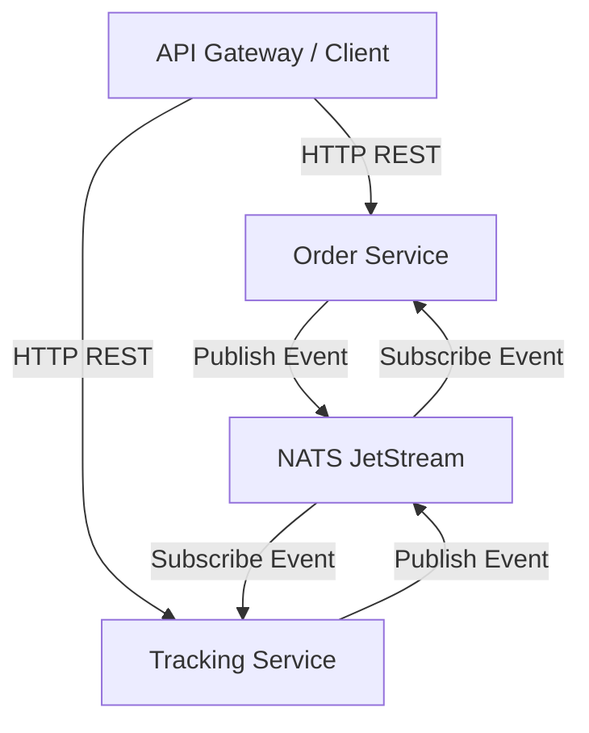
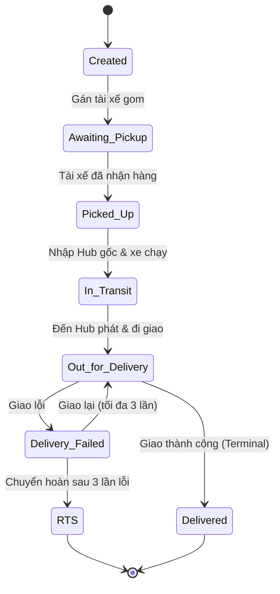

# Thiết Kế Hệ Thống NestJS Microservices Tối Giản

Tài liệu này tập trung thiết kế kiến trúc kỹ thuật dựa trên **NestJS, PostgreSQL và NATS JetStream** để giải quyết hai vấn đề cốt lõi: **Quản lý trạng thái (State Machine)** và **Kiến trúc hướng sự kiện (Event-Driven)**.

---

## 1. Thiết Kế Ranh Giới Dịch Vụ (Service Boundaries)

Chúng ta tách hệ thống thành **2 microservices độc lập**, mỗi service sở hữu cơ sở dữ liệu PostgreSQL riêng để đảm bảo tính cô lập và đúng nguyên tắc của microservices.



### Dịch vụ 1: Order Service (`order-service`)
*   **Database**: PostgreSQL (`db_order`)
*   **Nhiệm vụ**: Quản lý thông tin Đơn hàng, Bưu gửi, tính cước và cập nhật trạng thái hiển thị của Đơn hàng.
*   **Bảng dữ liệu**:
    *   `orders`: `id` (UUID), `sender_address`, `recipient_address`, `price_cents`, `status` (Trạng thái tổng hợp hiển thị).
    *   `parcels`: `id` (UUID), `order_id` (UUID), `weight_grams`, `status` (Trạng thái hiện tại của riêng bưu gửi).

### Dịch vụ 2: Tracking Service (`tracking-service`)
*   **Database**: PostgreSQL (`db_tracking`)
*   **Nhiệm vụ**: Tiếp nhận các lượt quét vật lý (từ tài xế, nhân viên kho) và ghi nhận nhật ký hành trình.
*   **Bảng dữ liệu**:
    *   `scan_events`: `id` (UUID), `parcel_id` (UUID), `status` (Trạng thái quét), `hub_id`, `created_at` (Mốc thời gian quét).

---

## 2. Máy Trạng Thái Bưu Gửi (Parcel State Machine)

Trạng thái bưu gửi được kiểm soát nghiêm ngặt qua tập hợp các trạng thái hợp lệ sau:



### Quy tắc chặn trạng thái (State Guard Rule):
*   Khi có sự kiện quét mới, `tracking-service` sẽ truy vấn `scan_events` mới nhất của `parcel_id` để biết trạng thái cũ.
*   Chỉ cho phép chuyển trạng thái theo sơ đồ trên (Ví dụ: Chặn quét `Delivered` trực tiếp từ trạng thái `Created` nếu chưa qua `In_Transit` / `Out_for_Delivery`).

---

## 3. Luồng Đi Của Sự Kiện (Event Flow & NATS Subject)

NATS JetStream đóng vai trò truyền tải các sự kiện thay đổi trạng thái giữa hai service một cách tin cậy.

### Bước 1: Tài xế / Nhân viên quét hàng
Nhân viên gọi API quét của `tracking-service`: `POST /scans` với payload `{ parcel_id, status, hub_id }`.

### Bước 2: Lưu Event & Phát sự kiện lên NATS
`tracking-service` kiểm tra máy trạng thái hợp lệ, ghi thêm một dòng vào bảng `scan_events`, sau đó phát sự kiện lên NATS JetStream:
*   **Subject**: `parcels.events.scanned`
*   **Payload**:
    ```json
    {
      "event_id": "uuid-sự-kiện",
      "parcel_id": "uuid-bưu-gửi",
      "status": "Picked_Up",
      "location": "hub-gốc-123",
      "timestamp": "ISO-8601-UTC"
    }
    ```

### Bước 3: Cập nhật trạng thái đơn hàng (Event Consumer)
`order-service` lắng nghe subject `parcels.events.scanned` thông qua JetStream Consumer:
1.  Cập nhật trạng thái của bưu gửi trong bảng `parcels` cục bộ tương ứng với `parcel_id`.
2.  Truy vấn lại trạng thái của tất cả bưu gửi thuộc cùng đơn hàng (`order_id`).
3.  Tính toán lại trạng thái tổng hợp của Đơn hàng:
    $$\text{Order.status} = \min(\text{Parcels.status})$$
    *(Sử dụng trọng số trạng thái: Created < Picked\_Up < In\_Transit < Out\_for\_Delivery < Delivered).*
4.  Cập nhật lại bảng `orders`.

---

## 4. Kế Hoạch Triển Khai NestJS Chuyển Tiếp

Để bắt tay vào viết code, bạn có thể triển khai dự án theo thứ tự sau:

1.  **Thiết lập Docker Compose**: Khởi động 2 cơ sở dữ liệu PostgreSQL (`db_order`, `db_tracking`) và 1 NATS server có bật chế độ JetStream (`nats-server -js`).
2.  **Viết cấu trúc Entity & API của `order-service`**:
    *   Tạo API `POST /orders` tạo đơn hàng và các bưu gửi đi kèm.
    *   Thực hiện kết nối cơ sở dữ liệu bằng TypeORM hoặc Prisma trong NestJS.
3.  **Viết `tracking-service` với máy trạng thái**:
    *   Tạo API `POST /scans` và triển khai lớp Guard để lọc/chặn các lượt quét trạng thái không hợp lệ.
4.  **Tích hợp NATS JetStream Client**:
    *   Viết module kết nối NATS JetStream trong NestJS và thực hiện gửi/nhận sự kiện giữa hai service.
