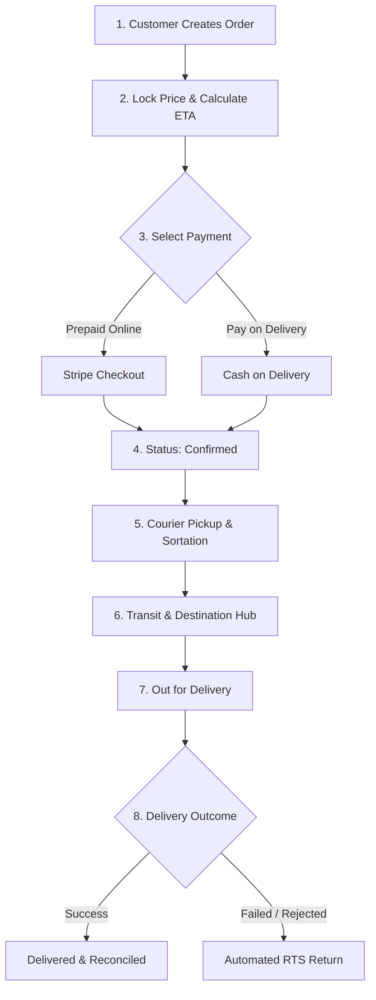

# Practice - Shipping System Specification

## Overview

The Domestic Parcel Shipping System is engineered based on the Hub-and-Spoke Consolidation Model utilizing a NestJS microservices architecture and a NATS event backbone.

In domestic logistics, directly transporting a small parcel from a Sender in Province A to a Recipient in Province B on a point-to-point basis is economically unviable and structurally unscalable. This system is specifically designed to solve the core operational bottleneck: coordinating a Many-to-One-to-Many physical flow.

The system optimizes network efficiency and minimizes per-unit logistics costs through a structured three-phase pipeline:
*   Consolidation (First-mile): Local pickup drivers gather individual parcels and bring them to a local Origin Hub.
*   Line-Haul Transport: High-capacity long-haul trucks transport these parcels over long distances between major inter-provincial hubs (Origin Hub → Destination Hub).
*   Deconsolidation & Last-Mile: At the destination hub, parcels are separated and assigned to local delivery drivers (vans or motorcycles) for final delivery to the end recipient.

---

## Aggregation Hierarchy

To eliminate structural ambiguity between physical entities, the system enforces a strict data topology:

Parcel -> Trip (Line-Haul Trip)

*   Parcel: The individual unit of shipment.
*   Trip (Line-Haul Trip): The scheduled journey of a vehicle carrying parcels between hubs.
*   Note on Scoped Slice: Physical consolidation (Bags and Manifests) is out of scope for the database model in this MVP slice. Tracking is managed at the individual Parcel level, and trips directly reference the constituent parcels being transported.

---

## End-to-End User Experience Flow

The system abstracts all physical routing and consolidation complexities from the user. Below is the visual workflow diagram of the end-to-end shipment process:

Below is the sequential description of the process flow:
*   **Order Creation**: Customer creates the order, locking the cước phí and calculating the ETA.
*   **Payment Processing**: Prepaid online payments are processed via Stripe Checkout, or COD is chosen.
*   **Dispatch & Transit**: The courier picks up the package, which is sorted at the origin hub and transported across major line-haul trips.
*   **Delivery & Outcome**: Last-mile courier delivers the package, capturing signature (POD), or triggering the automated RTS return process on the 3rd failure or recipient rejection.

---

## Business Rules

Rules are grouped by operational area. Each has an enforcement point: a database constraint, service-layer logic, or a state-machine guard.

### Order & Parcel
*   An order must have a verified sender, a recipient, valid addresses, and at least one parcel before transitioning to an Active state.
*   A fixed price and Estimated Time of Arrival (ETA) are assigned to each order at creation and locked; changes are barred unless a physical dimension/weight discrepancy is flagged during initial hub ingestion.
*   An order reaches a terminal Complete state only when all its constituent parcels are marked as Delivered or Returned to Sender.

### Tracking & Scan Events
*   Every state transition must produce an immutable, timestamped scan event payload.
*   Scan events are strictly append-only; corrections require a new compensatory event record, never a database UPDATE.
*   An order's master visibility status is computed from the least-advanced status among its constituent parcels’ latest scan events, and is stored as a materialized projection (read model) to satisfy the latency target.

### Delivery & Exceptions
*   Failed deliveries may be re-attempted up to 3 times. Exceeding this limit or recipient rejection triggers an automatic Return to Sender (RTS) sub-flow.
*   Returned parcels travel backward through the reverse path of the network and require scan tracking at every hub.
*   Cash-on-delivery (COD) collections must be captured, signed, and reconciled atomically upon successful last-mile scan.

---

## Rule Catalogue

| ID | Rule Description | Operational Area | Enforcement Point |
| :--- | :--- | :--- | :--- |
| BR-01 | Price and ETA are locked at order creation and cannot be changed post-confirmation. | Pricing | Service Logic |
| BR-02 | Out-of-delivery status is permitted only after arrival at final destination hub. Wrong scans trigger Misrouted status and corrective routing. | Delivery | FSM State Guard |
| BR-03 | All scan events are immutable and append-only. Historical logs cannot be updated or deleted. | Data Integrity | DB Partition (Insert Only) |
| BR-04 | Exceeding 3 failed delivery attempts triggers an automatic Return to Sender (RTS) flow. | Exceptions | Service Logic |
| BR-05 | Order status is a materialized projection computed as the least-advanced status of its parcels. | Order | Service Logic Aggregate |
| BR-06 | Weight discrepancies at the hub trigger a downstream billing audit rather than holding the parcel. | Ingestion | Service Logic + Audit Log |
| BR-07 | Prepaid orders must verify payment authorization via Stripe before dispatching pickup tasks. | Payment | Stripe API Webhooks |
| BR-08 | Any change in parcel state triggers NATS events to send automated Email notifications to participants. | Notifications | NATS Event Consumers |

---

## Requirements

### Functional Requirements
*   Order Management: Capture order payloads containing sender/recipient profiles, multi-parcel details, and locked pricing/ETA.
*   Stripe Online Checkout: Process prepaid orders using Stripe Checkout sessions and handle webhook callbacks.
*   First/Last-Mile Dispatch: Route pickup and delivery tasks to local couriers.
*   Real-Time Tracking Ledger: Emit and persist timestamped events at every network node scan.
*   Mailer Notifications: Dispatch email updates to customers upon status changes.
*   Exception Workflows: Handle delivery retry limits, RTS loops, and misrouted parcel re-routing.
*   COD Settlement: Capture signatures and reconcile cash collected by couriers.

### Non-Functional Requirements

| Attribute | Target Metric / Operational Note |
| :--- | :--- |
| Auditability | 100% append-only scan event log; database-level modifications to historical entries are blocked. |
| Throughput | The system must handle a peak sustained throughput of 2,500 scans/second without performance degradation. |
| Latency | End-consumer order status queries must return responses in under 300 ms at P99 (served from Redis). |
| Consistency | Strong transactional consistency (ACID) within single service boundaries. Eventual consistency across services via NATS JetStream. |
| Security | Field-level encryption (AES-256-GCM) for PII data; Role-Based Access Control (RBAC). |
