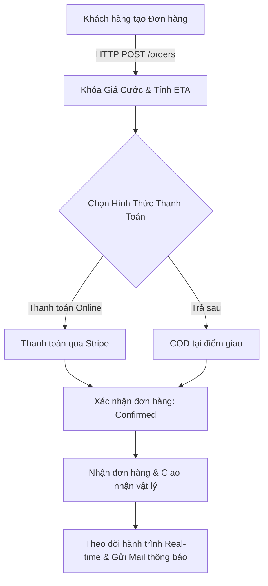

# Đặc Tả Yêu Cầu Kỹ Thuật (Shipping System Specification) - Cập Nhật Trải Nghiệm Người Dùng (UX)

Tài liệu này đặc tả hệ thống vận chuyển bưu gửi nội địa dựa trên trải nghiệm của Khách hàng (Người gửi & Người nhận), tích hợp cổng thanh toán trực tuyến **Stripe** và hệ thống thông báo qua **Email**.

---

## 1. Trải Nghiệm Người Dùng & Quy Trình Nghiệp Vụ (End-to-End UX Flow)

Hệ thống che giấu toàn bộ sự phức tạp của việc tối ưu hóa chi phí vận hành ở phía sau, chỉ hiển thị giao diện tinh giản cho Khách hàng:

### A. Tạo Đơn Hàng & Khóa Cước
*   Người gửi tạo đơn hàng kèm theo địa chỉ và khối lượng bưu gửi.
*   Hệ thống tự động tính toán cước phí vận chuyển cố định tại thời điểm tạo đơn và tính toán **ETA** (Thời gian dự kiến giao hàng thành công, ví dụ: 2 ngày). Mức phí và ETA này được khóa cứng và không thay đổi suốt hành trình đơn hàng.

### B. Hình Thức Thanh Toán (Payment Options)
Khách hàng có 3 tùy chọn thanh toán:
1.  **Thanh toán Trả trước (Online)**: Tích hợp trực tiếp với cổng thanh toán **Stripe** (thông qua thẻ tín dụng/Apple Pay). Đơn hàng chỉ chuyển sang trạng thái `Confirmed` và phân công tài xế lấy hàng sau khi Stripe báo giao dịch thành công.
2.  **Thu hộ khi nhận hàng (COD)**: Người nhận sẽ trả tiền mặt trực tiếp cho tài xế chặng cuối khi bưu gửi được giao thành công.
3.  **Thanh toán Trả sau (Postpaid)**: Người gửi trả cước phí định kỳ/sau (thường áp dụng cho khách hàng doanh nghiệp).

### C. Theo Dõi Đơn Hàng (Tracking Timeline)
Người gửi và Người nhận có thể tra cứu hành trình của bưu gửi thông qua liên kết theo dõi (Tracking Link) với các mốc trạng thái cụ thể:
*   `Awaiting_Pickup` (Tài xế đang đi lấy hàng).
*   `Picked_Up` (Tài xế đã lấy hàng).
*   `At Origin Hub` (Đã đến trung tâm phân loại gốc).
*   `In Transit` (Đang vận chuyển liên tỉnh).
*   `At Destination Hub` (Đã đến kho phát chặng cuối).
*   `Out For Delivery` (Tài xế đang đi giao hàng).
*   `Delivered` (Giao hàng thành công).

### D. Thông Báo Tự Động (Email Notifications)
Hệ thống tự động gửi email cho Người gửi và Người nhận ở các mốc quan trọng:
1.  **Tạo đơn thành công**: Email gửi Người gửi kèm mã vận đơn và thông tin thanh toán (Stripe/COD).
2.  **Đã lấy hàng**: Email gửi Người nhận báo đơn hàng đã bắt đầu di chuyển kèm ETA dự kiến.
3.  **Đang giao hàng**: Email gửi Người nhận kèm số điện thoại tài xế giao chặng cuối.
4.  **Giao thành công**: Email gửi Người gửi báo hoàn tất đơn hàng và hóa đơn thanh toán.
5.  **Giao thất bại/Chuyển hoàn**: Email gửi Người gửi báo đơn hàng gặp sự cố và bắt đầu quy trình quay đầu (RTS).

### E. Quy Trình Chuyển Hoàn Tự Động (Auto-RTS)
*   Nếu tài xế chặng cuối quét báo giao thất bại quá 3 lần (Ví dụ: Khách không nghe máy, Khách hẹn ngày khác) **HOẶC** Người nhận chủ động từ chối nhận hàng (`Customer Rejected`).
*   Hệ thống lập tức kích hoạt trạng thái hoàn trả hàng (`RTS`), đổi hướng di chuyển `direction = Reverse` để định tuyến đưa bưu gửi quay về kho phát gốc và gửi email cảnh báo cho Người gửi.

---

## 2. Quy Tắc Nghiệp Vụ Cốt Lõi (Business Rules)

*   **BR-01 (Cước & ETA Cố Định)**: Giá cước và thời gian dự kiến (ETA) được xác định ngay khi tạo đơn và không thay đổi trong suốt hành trình.
*   **BR-02 (Tích hợp Stripe)**: Đối với các đơn hàng trực tuyến, cước phí được xác thực thanh toán qua Stripe webhook trước khi đơn hàng chuyển sang trạng thái phân công tài xế lấy hàng (`Awaiting_Pickup`).
*   **BR-03 (Chuyển hoàn tự động)**: Đạt 3 lần giao thất bại hoặc có sự kiện quét khách hàng từ chối nhận (`Customer_Rejected`) sẽ buộc bưu gửi quay đầu về kho gốc, giữ nguyên mã vận đơn (tracking ID).
*   **BR-04 (Xác nhận POD & Đối soát)**: Khi giao thành công, tài xế phải cập nhật thông tin chữ ký/ảnh chụp và thu đủ COD (nếu có). Tiền COD sẽ được đối soát cuối ca thông qua quy trình quyết toán tài chính.
