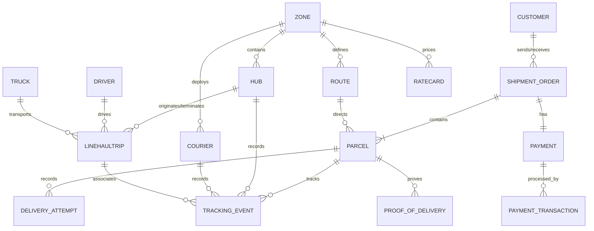

# Entity-Relationship Diagram (ERD)

This document describes the PostgreSQL data model, aligned with the simplified NestJS microservice architecture, including payments, payment transaction tracking, and delivery attempts.

---

## Visual Diagram (Mermaid)

---

## 1. Entities & Fields

### CUSTOMER
| Field | Type | Description |
| :--- | :--- | :--- |
| `id` | uuid PK | Unique identifier of the customer (sender or recipient). |
| `name_enc` | string | Full name, stored with field-level encryption (PII). |
| `phone_enc` | string | Phone number, field-level encrypted (PII). |
| `phone_hash` | string (64-char hex) | Deterministic HMAC-SHA256(phone), keyed by `PII_ENCRYPTION_KEY`. `phone_enc`'s random IV makes it unusable for an equality lookup, so this column exists solely so Order Service can find an existing customer by phone and reuse the row instead of creating a duplicate on every order (see `docs/lld/order-service.md` § Key Design Decisions). Indexed (`idx_customer_phone_hash`), not unique — a hash collision should degrade to "treated as the same customer," never a hard DB error. |
| `address_enc` | string | Full street address, field-level encrypted (PII). |
| `region_code` | string | Plaintext postal/region code kept in plaintext for sorting/routing without decrypting PII. |

### SHIPMENT_ORDER
| Field | Type | Description |
| :--- | :--- | :--- |
| `id` | uuid PK | Unique identifier of the shipment order. |
| `sender_id` | uuid FK | References the CUSTOMER who sends the order. |
| `recipient_id` | uuid FK | References the CUSTOMER who receives the order. |
| `rate_card_id` | uuid FK | The rate card used to price the order at creation. |
| `price_cents` | int | Fixed price in minor units (cents), locked at order creation. |
| `expected_delivery_at` | timestamp | Locked calculated ETA. |
| `status` | enum | Projections status (Draft, Created, Confirmed, Active, Complete, Partially_Delivered, Lost, Damaged, Cancelled). |

### PARCEL
| Field | Type | Description |
| :--- | :--- | :--- |
| `id` | uuid PK | Unique identifier of an individual parcel (a pallet is a large parcel). |
| `shipment_order_id` | uuid FK | The order this parcel belongs to. |
| `route_id` | uuid FK, nullable | The corridor/route this parcel travels; set once routing is known. |
| `declared_weight_grams` | int | Weight declared by the sender at order creation. |
| `actual_weight_grams` | int, nullable | Weight measured at hub inbound; null until scanned. |
| `type` | enum | parcel or pallet; pallets route away from standard conveyor sortation lines. |
| `direction` | enum | Forward or Reverse_RTS; the routing engine uses this with location to avoid RTS loops. |
| `state` | enum | Parcel lifecycle: Created, InHub, InTransit, Misrouted, OutForDelivery, Delivered, Lost, Damaged. |
| `sla_expected_delivery` | timestamp, nullable | Target delivery deadline; computed from RATECARD lookup at order creation. |

### DELIVERY_ATTEMPT
| Field | Type | Description |
| :--- | :--- | :--- |
| `id` | uuid PK | Unique identifier of the attempt. |
| `parcel_id` | uuid FK | References the PARCEL being delivered. |
| `direction` | enum | `Forward` or `Reverse_RTS`, mirrors `PARCEL.direction`. BR-04 resets the attempt counter to zero after a 3rd-failure RTS, so the reverse leg reuses `attempt_number` 1-3 for the same `parcel_id`; `UNIQUE(parcel_id, direction, attempt_number)` keeps the two legs' numbering from colliding. |
| `attempt_number` | int | Delivery attempt number (1, 2, or 3) within the current `direction`. Max of 3 failed attempts triggers automatic RTS (BR-04). |
| `outcome` | enum | `Failed` or `Succeeded`. |
| `failure_reason` | string, nullable | Reason for delivery failure (e.g. customer absent, rejected); null when `outcome = Succeeded`. |
| `created_at` | timestamp | Timestamp when the attempt was made. |

### PAYMENT
| Field | Type | Description |
| :--- | :--- | :--- |
| `id` | uuid PK | Unique identifier of the payment record. |
| `shipment_order_id` | uuid FK | References the SHIPMENT_ORDER this payment is for. |
| `type` | enum | `PREPAID_STRIPE` only — `CHECK` constraint in `db/init-db.sql`. `POSTPAID`/COD was cut from scope (see `CLAUDE.md` § SCOPE). |
| `amount_cents` | int | Value of the payment in cents. |
| `status` | enum | `Unpaid`, `Paid`, `Awaiting_Settlement`. |

### PAYMENT_TRANSACTION
| Field | Type | Description |
| :--- | :--- | :--- |
| `id` | uuid PK | Unique identifier of the transaction. |
| `payment_id` | uuid FK | References the PAYMENT. |
| `provider` | string | Payment provider (e.g. `STRIPE`, `PAYPAL`). |
| `external_transaction_id` | string | Provider's transaction/intent ID (e.g. Stripe PaymentIntent ID). |
| `external_reference_id` | string, nullable | Provider's secondary reference (e.g. Stripe Charge ID). |
| `status` | string | Provider transaction status (`succeeded`, `failed`, `pending`). |
| `created_at` | timestamp | Timestamp of the transaction. |

### OUTBOX
| Field | Type | Description |
| :--- | :--- | :--- |
| `id` | uuid PK | Unique identifier of the outbox row. |
| `event_id` | uuid, unique | The `event_id` published to NATS as `Nats-Msg-Id` (broker-level dedup). |
| `event_type` | string | The NATS subject this row publishes to (e.g. `order.created`). |
| `payload` | jsonb | The event body. |
| `status` | enum | `PENDING`, `PUBLISHED`. |
| `created_at` | timestamp | When the row was written (same transaction as the triggering write). |
| `published_at` | timestamp, nullable | When the poller successfully published it. |

Transactional Outbox for Order Creation only (`docs/02-HLD.md` § Idempotency and outbox mechanics) — no relationship to other entities; not a general-purpose event log.

### LINEHAULTRIP
| Field | Type | Description |
| :--- | :--- | :--- |
| `id` | uuid PK | Unique identifier of a line-haul journey between hubs. |
| `origin_hub_id` | uuid FK | Hub where the trip departs. |
| `dest_hub_id` | uuid FK | Hub where the trip arrives. |
| `driver_id` | uuid FK | Driver assigned to the trip. |
| `truck_id` | uuid FK | Truck asset assigned to the trip. |

### HUB
| Field | Type | Description |
| :--- | :--- | :--- |
| `id` | uuid PK | Unique identifier of a physical hub. |
| `zone_id` | uuid FK | The zone this hub serves. |
| `name` | string | Human-readable hub name. |

### ZONE
| Field | Type | Description |
| :--- | :--- | :--- |
| `id` | uuid PK | Unique identifier of a geographic zone. |
| `region_code` | string | Plaintext routing key used by the sortation engine. |

### ROUTE
| Field | Type | Description |
| :--- | :--- | :--- |
| `id` | uuid PK | Unique identifier of a corridor between two zones. |
| `origin_zone_id` | uuid FK | Origin zone of the route. |
| `dest_zone_id` | uuid FK | Destination zone of the route. |

### RATECARD
| Field | Type | Description |
| :--- | :--- | :--- |
| `id` | uuid PK | Unique identifier of a pricing entry. |
| `origin_zone_id` | uuid FK | Origin zone the rate applies to. |
| `dest_zone_id` | uuid FK | Destination zone the rate applies to. |
| `parcel_type` | enum | Parcel type (`parcel` or `pallet`). |
| `price_cents` | int | Fixed price in cents for this route × type. |
| `sla_days` | int | Number of days from order creation to `PARCEL.sla_expected_delivery` for this route × type. |
| `effective_from` | timestamp | Start of this rate card version's validity window. |
| `effective_to` | timestamp, nullable | End of this rate card version's validity window; null while still current. |

### COURIER
| Field | Type | Description |
| :--- | :--- | :--- |
| `id` | uuid PK | Unique identifier of a first/last-mile courier. |
| `zone_id` | uuid FK | The zone the courier operates in. |
| `role` | enum | RBAC role separating Courier from Hub Operator, Dispatcher, Admin. |

### DRIVER
| Field | Type | Description |
| :--- | :--- | :--- |
| `id` | uuid PK | Unique identifier of a line-haul driver. |
| `name_enc` | string | Driver name, field-level encrypted (PII). |

### TRUCK
| Field | Type | Description |
| :--- | :--- | :--- |
| `id` | uuid PK | Unique identifier of a line-haul truck asset. |
| `plate` | string | License plate / registration of the truck. |

### TRACKING_EVENT
| Field | Type | Description |
| :--- | :--- | :--- |
| `id` | uuid PK | Unique identifier of a tracking event (append-only). |
| `event_id` | uuid, unique | The NATS event envelope's `event_id`; consumer-side dedup (2nd idempotency layer, alongside the broker-level JetStream dedup). |
| `parcel_id` | uuid FK | The parcel that was scanned. |
| `hub_id` | uuid FK, nullable | Hub where the scan happened; null for courier-side scans. |
| `courier_id` | uuid FK, nullable | Courier who recorded the scan; null for hub-side scans. |
| `linehaul_trip_id` | uuid FK, nullable | The line-haul trip the parcel was moving on; set for transit scans. |
| `event_type` | enum | Scan type (e.g. `PICKUP`, `HUB_RECEIVE`, `DEPARTED_LINEHAUL`, `ARRIVED_AT_HUB`, `OUT_FOR_DELIVERY`, `DELIVERY_FAILED`, `DELIVERED`, `MISROUTED`, `RTS`). |
| `created_at` | timestamp | Immutable event timestamp (UTC); the store is strictly append-only. |

### PROOF_OF_DELIVERY
| Field | Type | Description |
| :--- | :--- | :--- |
| `id` | uuid PK | Unique identifier of a proof-of-delivery record. |
| `parcel_id` | uuid FK | The parcel that was delivered. No `tracking_event_id` column — Courier writes this row synchronously, before Tracking has even consumed `parcel.delivered` and appended the corresponding `DELIVERED` row (different service, async, cross-schema); there is no ID Courier could reference at write time. |
| `signature_url` | string, nullable | Stored recipient signature image URL. |
| `photo_url` | string, nullable | Stored delivery photo URL. |

---

## 2. Relationships

| From | To | Cardinality | Meaning |
| :--- | :--- | :--- | :--- |
| CUSTOMER | SHIPMENT_ORDER | 1 : N | A customer sends/receives many orders — enforced in code via `phone_hash` lookup-and-reuse at order creation, not just an unenforced cardinality note (see `phone_hash` above). |
| SHIPMENT_ORDER | PARCEL | 1 : N | An order contains one or more parcels |
| SHIPMENT_ORDER | PAYMENT | 1 : 1 | An order has one payment record |
| PAYMENT | PAYMENT_TRANSACTION | 1 : N | Each checkout/webhook attempt writes a transaction row; `PAYMENT_TRANSACTION.payment_id` has no UNIQUE constraint (only `external_transaction_id` does, for webhook idempotency) — a retried checkout (BR-08, `PAYMENT` still `Unpaid`) can legitimately produce more than one |
| PARCEL | DELIVERY_ATTEMPT | 1 : N | A parcel has many delivery attempts |
| PARCEL | TRACKING_EVENT | 1 : N | Each parcel has many scan events (tracking timeline) |
| ROUTE | PARCEL | 1 : N | A parcel travels along one corridor/route |
| HUB | LINEHAULTRIP | 1 : N | Hub as origin / destination of trips |
| DRIVER / TRUCK | LINEHAULTRIP | 1 : N | Assigned to trips |
| HUB / COURIER | TRACKING_EVENT | 1 : N | A scan is recorded at a hub or by a courier |
| PARCEL | PROOF_OF_DELIVERY | 1 : 0..1 | Proof of delivery is linked to the parcel. No direct `TRACKING_EVENT` relationship — Courier writes `PROOF_OF_DELIVERY` synchronously, before Tracking (a different, async, cross-schema service) has appended the corresponding `DELIVERED` row; there is no `tracking_event_id` Courier could reference at write time. Safe to associate via `parcel_id` alone because BR-04 allows at most one true `DELIVERED` event per parcel in this scoped slice (see note below). |
| ZONE | HUB / ROUTE / RATECARD / COURIER | 1 : N | Zone groups hubs, routes, rate cards, and couriers |

> **Note (deferred, out of scope):** `1 : 0..1` holds under BR-04 as written — RTS only fires after 3 *failed* delivery attempts, never after a successful `Delivered`. A "recipient receives, then returns the parcel" flow (post-delivery return) is not modeled in this scoped slice: `Delivered`/`Complete` are terminal states today, and reopening them would require new FSM guards and a BR-04 revision. Not scoped into the 16-day slice; revisit if/when this flow is prioritized.
