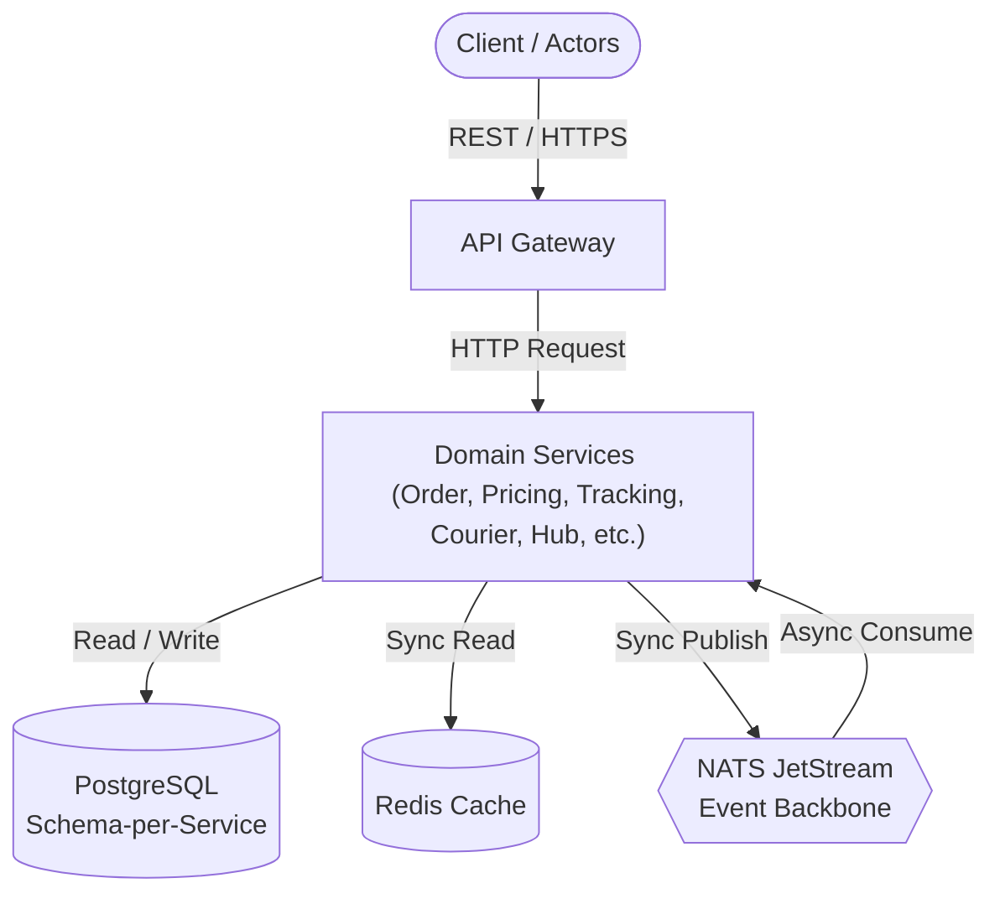

# Shipping System - High Level Design

## Table of Contents
1. [Introduction](#introduction)
   - [Purpose](#purpose)
   - [Scope](#scope)
   - [References](#references)
2. [Architecture](#architecture)
   - [Architecture Overview](#architecture-overview)
   - [Architectural Style](#architectural-style)
   - [Logical Components](#logical-components)
3. [Services & Data Ownership](#services--data-ownership)
4. [Communication Model](#communication-model)
   - [Synchronous (REST)](#synchronous-rest)
   - [Asynchronous (NATS JetStream)](#asynchronous-nats-jetstream)
   - [NATS Subject Map](#nats-subject-map)
5. [Event & API Contracts](#event--api-contracts)
   - [Event Contracts](#event-contracts)
   - [REST Endpoints](#rest-endpoints)
6. [Design Solutions for Specific Cases](#design-solutions-for-specific-cases)
   - [Misrouted handling and corrective re-route (BR-02)](#misrouted-handling-and-corrective-re-route-br-02)
   - [RTS after 3 failed attempts (BR-04)](#rts-after-3-failed-attempts-br-04)
   - [ORDER.status projection mechanics (BR-05, BR-07, ADR-001)](#orderstatus-projection-mechanics-br-05-br-07-adr-001)
   - [Weight mismatch reconciliation and passive lost-parcel detection (BR-06 + ERD design note)](#weight-mismatch-reconciliation-and-passive-lost-parcel-detection-br-06--erd-design-note)
   - [Idempotency and outbox mechanics (Order Creation only)](#idempotency-and-outbox-mechanics-order-creation-only)
   - [Prepaid Payment Verification via Stripe (BR-08)](#prepaid-payment-verification-via-stripe-br-08)
   - [Notification Delivery (BR-09)](#notification-delivery-br-09)
7. [Data Isolation Strategy](#data-isolation-strategy)
   - [Schema-per-Service](#schema-per-service)
   - [Logical Foreign Keys](#logical-foreign-keys)
8. [Message Broker & Fault Tolerance](#message-broker--fault-tolerance)
   - [Stream & Consumer Configuration](#stream--consumer-configuration)
   - [Retry & Dead Letter Queue (DLQ)](#retry--dead-letter-queue-dlq)
9. [Cross-cutting Concerns](#cross-cutting-concerns)
10. [Architectural Evaluation & Strengths](#architectural-evaluation--strengths)
11. [Key Design Decisions (ADRs)](#key-design-decisions-adrs)
12. [Monorepo & Shared Library Structure](#monorepo--shared-library-structure)

---

## Introduction

### Purpose
This High-Level Design defines the architecture of the Shipping System backend vertical slice: the services, how they own data, how they communicate, the event and API contracts, and the cross-cutting concerns. It is the implementation contract — scaffolding and coding follow directly from it.

### Scope
- **In scope**: backend vertical slice, all six actors exercised via REST API; the full physical flow order → pickup → hub → line-haul → delivery → tracking; exception handling (terminal states, misroute, RTS, reconciliation).
- **Out of scope**: frontend UIs, CI/CD, cloud deployment. The system runs locally via Docker Compose.

### References
- [docs/01-ERD.md](file:///home/dunguyen/Training/nestjs/shipping-system/docs/01-ERD.md)
- [docs/04-business-rules.md](file:///home/dunguyen/Training/nestjs/shipping-system/docs/04-business-rules.md)
- [docs/06-specification.md](file:///home/dunguyen/Training/nestjs/shipping-system/docs/06-specification.md) — scope, functional/non-functional requirements
- [docs/lld/](file:///home/dunguyen/Training/nestjs/shipping-system/docs/lld/00-conventions.md) — API DTOs/validation/error codes, DB indexes/constraints, **plus each service's own Use Cases and Sequence Diagrams**, split one file per service

---

## Architecture

### Architecture Overview
The system is a set of NestJS microservices over a NATS JetStream event backbone, with a REST API gateway at the edge. PostgreSQL is the system of record (shared instance, schema-per-service for the slice); Redis is a read-through cache for hot projections. Communication is asynchronous by default (events); synchronous REST is used only where an immediate answer is required (pricing at order creation).

### Architectural Style
- **Event-driven microservices**: services are decoupled, communicating through published events; each owns its data and reacts to others' events.
- **Append-only event store as source of truth**: every state transition emits an immutable scan event; read models (projections) are derived from the stream.
- **CQRS-lean**: writes go through the domain + outbox; reads serve materialized projections to meet the latency target.

### Logical Components


- **API Gateway** — auth, routing, request validation, OpenAPI.
- **Domain services** — Order, Pricing, Tracking, Courier, Hub/Sortation, Line-haul, Dispatcher.
- **NATS JetStream** — event backbone + per-order subjects for serialized projection writes.
- **PostgreSQL** — durable storage, schema-per-service.
- **Redis** — read cache for `ORDER.status` and hot tracking lookups. **Write-through**: the `ORDER.status` projection consumer writes to Redis in the same step it persists to Postgres (no separate invalidation pass); reads fall back to Postgres on a cache miss.

---

## Services & Data Ownership

Each entity is write-owned by exactly one service. Cross-service references are plain IDs, never foreign keys; a service learns about another's data only through events. The slice uses a shared PostgreSQL with schema-per-service, but logical ownership is strict.

| Service | Responsibility | Owns (write) | Notes |
| :--- | :--- | :--- | :--- |
| **Order** | Order intake, pricing orchestration, payment flow, order lifecycle | `CUSTOMER`, `ORDER`, `PARCEL`, `PAYMENT`, `PAYMENT_TRANSACTION` | Receives order requests, calls Pricing synchronously, owns the parcel state machine, prepaid checkout sessions, Stripe webhook integration, and the `ORDER.status` write-back projection. |
| **Pricing** | Rate-card lookup, price calculation | `RATECARD` | Returns a fixed price for route × parcel type; price locked at order creation. |
| **Tracking** | Append-only scan-event store, tracking timeline | `TRACKING_EVENT` | Consumes all scan events, stores them immutably, derives projections. Listens to `parcel.delivered`; does NOT own `PROOF_OF_DELIVERY`. |
| **Courier** | First/last-mile pickup & delivery, POD | `COURIER`, `PROOF_OF_DELIVERY`, `DELIVERY_ATTEMPT` | Manages pickup/delivery legs, write-owns proof-of-delivery, and delivery attempt counts. Never writes `TRACKING_EVENT` directly (Tracking is sole writer) — on each REST call it writes only its own tables, then synchronously publishes the corresponding NATS event in the same request; Tracking consumes it and appends the `TRACKING_EVENT` row. No cross-service call, no outbox. |
| **Hub / Sortation** | Inbound scan, network topology | `ZONE`, `ROUTE`, `HUB` | `HUB_RECEIVE` scan, parcel inbound/outbound; owns zones, routes, and hub records. (Bag/manifest consolidation is physical-only, not modeled.) |
| **Line-haul** | Line-haul trip lifecycle | `LINEHAULTRIP` | Trip creation, depart/arrive hooks; on arrival, hands off to Hub/Sortation which emits `parcel.arrived_at_hub` per parcel via `linehaul_trip_id`. |
| **Dispatcher** | Assignment & planning | `DRIVER`, `TRUCK` (assignment) | Assigns driver/truck to trips and couriers to legs. |
| **Notification** | Best-effort customer email notifications | *(none — stateless)* | Subscribes to existing lifecycle events (`order.created`, `payment.succeeded`, `parcel.delivered`, `parcel.rts`, `parcel.lost_suspected`); sends email via a provider SDK. Owns no data, no outbox, no retries — a send failure is logged and dropped, never blocks or retries the triggering transaction (BR-09). |

> [!NOTE]
> Ownership rule highlights: `ZONE` and `ROUTE` belong to Hub/Sortation (network topology). `PROOF_OF_DELIVERY` is write-owned by Courier; `PAYMENT` and `PAYMENT_TRANSACTION` are write-owned by Order. Tracking only consumes events and records them in its append-only store.

> [!WARNING]
> **Accepted MVP risk — no outbox outside Order Creation**: Courier and Hub/Sortation publish their NATS events synchronously in the same request as their own DB write, with no outbox (see "Idempotency and outbox mechanics" below — it covers Order Creation only). If the NATS publish fails after the DB commit, that scan event is permanently missing from `TRACKING_EVENT`, silently breaking the "100% append-only audit log" target. Accepted for this 16-day slice; production hardening would extend the outbox pattern to these two services.
>
> The same gap exists on Order Service's `POST /orders/{id}/checkout` webhook handler: it updates `ORDER.status` and writes `PAYMENT_TRANSACTION` directly, then publishes `payment.succeeded` with no outbox. The blast radius is smaller — `ORDER.status` itself is already correct even if the publish is lost, so there's no audit-log gap like the scan-event case — but downstream consumers (Tracking, Notification) would silently miss the transition. Also accepted for this slice, for the same reason: extending the outbox pattern to a third service isn't worth the added complexity at this scope.

---

## Communication Model

### Sync vs Async Communication Model

| Model | Technology | Use Case | Pattern |
| :--- | :--- | :--- | :--- |
| **Synchronous (Sync)** | **REST API** | When the caller needs an immediate result: Order → Pricing at order creation (price must be returned and locked). | Client ➔ API Gateway ➔ Service (Request/Response). |
| **Asynchronous (Async)** | **NATS JetStream** | Default for all other workflows (order updates, scan sweeps, dispatch, notifications). | Event Publishing ➔ JetStream ➔ Decoupled Consumers. |

*   **Per-aggregate serialization**: order-projection events publish to `orders.status.<order_id>`; JetStream guarantees in-subject ordering, so one order's projection is written serially while different orders run in parallel across the consumer group (ADR-001).

### NATS Subject Map
Convention: `<domain>.<event>`, lowercase, dot-separated. Per-order projection subject carries the order id. The one deliberate exception is `orders.status.<order_id>` (plural `orders`): it is a per-aggregate projection-write channel, not a domain event, so it is namespaced separately from the `<domain>.<event>` event stream on purpose.

| Subject | Producer | Consumers | Meaning |
| :--- | :--- | :--- | :--- |
| `order.created` | Order | Tracking, Pricing (audit), Notification | A new order with parcels was created |
| `payment.succeeded` | Order | Order, Tracking, Notification | Emitted upon Stripe webhook validation; updates `ORDER.status = Confirmed` |
| `parcel.picked_up` | Courier | Tracking, Order | First-mile pickup scan recorded |
| `parcel.hub_received` | Hub | Tracking, Order | Parcel inbounded at a hub (`HUB_RECEIVE`) |
| `parcel.loaded_for_linehaul` | Hub | Tracking | Parcel loaded onto a line-haul trip; payload includes `linehaul_trip_id` |
| `parcel.arrived_at_hub` | Hub | Tracking, Order | Parcel inbounded at destination hub; payload includes `linehaul_trip_id` |
| `trip.departed` | Line-haul | Tracking | A line-haul trip departed origin hub |
| `trip.arrived` | Line-haul | Tracking, Hub | A trip arrived at destination hub |
| `parcel.misrouted` | Hub | Tracking, Order | Parcel scanned at an off-route hub |
| `parcel.out_for_delivery` | Courier | Tracking, Order | Last-mile dispatch |
| `parcel.delivered` | Courier | Tracking, Order, Notification | Delivered, carries POD image links |
| `parcel.rts` | Courier | Tracking, Order, Notification | Return-to-Sender triggered; payload sets `PARCEL.direction = Reverse_RTS` and resets the failed-delivery-attempt counter to zero for the reverse leg |
| `parcel.lost_suspected` | Tracking (job) | Order, Notification | SLA threshold breached with no next scan; passive lost-parcel detection |
| `orders.status.<order_id>` | Tracking projector | Order projection consumer | Per-order subject for serialized projection writes (JetStream ordering) |

> [!NOTE]
> **Event Triggers (Sensor vs API)**:
> - `parcel.loaded_for_linehaul` & `parcel.arrived_at_hub`: Automatically triggered by Hub Operators scanning barcodes using sorting devices via the existing `POST /hubs/{id}/receive` endpoint. The Hub Sortation service parses the scan location metadata (e.g., scanning onto a line-haul container vs scanning inbound at a hub) to select the correct event.
> - `trip.departed` & `trip.arrived`: Triggered automatically via GPS geofencing when a line-haul truck departs the origin hub's radius or enters the destination hub's radius. For manual fallback or systems lacking GPS integration, Dispatchers trigger these events using the `/trips/{id}/depart` and `/trips/{id}/arrive` API endpoints.

---

## Event & API Contracts

### Event Contracts
Each event has: a name, a version, a payload schema (fields + types), a producer, and consumers.
- **Versioning**: a breaking change creates a new version (e.g. `parcel.delivered.v2`); the old version is not edited.
- **Money** is integer cents; **weight** is integer grams; all timestamps are UTC.

#### Example: `parcel.delivered` (v1)
```json
{
  "event_id": "uuid",
  "occurred_at": "2026-06-30T08:15:00Z",
  "parcel_id": "uuid",
  "order_id": "uuid",
  "courier_id": "uuid",
  "pod": {
    "signature_url": "string|null",
    "photo_url": "string|null"
  }
}
```
- **Producer**: Courier Service.
- **Consumers**: Tracking (append to `ScanEvent`), Order (advance parcel/order state).

### REST Endpoints
The gateway handles authentication, RBAC, request routing, and validation; OpenAPI is generated from DTOs. Endpoints are grouped by actor. All write endpoints validate against business-rule guards before emitting events.

| Actor | Endpoint | Purpose |
| :--- | :--- | :--- |
| **Sender** | `POST` `/orders` | Create an order; returns order + locked price |
| **Sender** | `GET` `/orders/{id}/quote` | Preview price before creation |
| **Sender** | `POST` `/orders/{id}/checkout` | Create a Stripe Checkout/PaymentIntent session |
| **Stripe System** | `POST` `/payments/webhook` | Receive async payment succeeded/failed webhooks |
| **Recipient** | `GET` `/tracking/{tracking_id}` | End-to-end tracking timeline from scan events. `{tracking_id}` = `ORDER.id`; the response aggregates the scan timeline across every parcel under that order. |
| **Courier** | `POST` `/couriers/legs/{id}/pickup` | Record a pickup scan |
| **Courier** | `POST` `/couriers/legs/{id}/deliver` | Record delivery + upload POD |
| **Hub Operator** | `POST` `/hubs/{id}/receive` | `HUB_RECEIVE` scan |
| **Dispatcher** | `POST` `/trips`, `POST /trips/{id}/assign` | Create trip, assign driver/truck |
| **Dispatcher** | `POST` `/trips/{id}/depart` | Manually mark trip as departed (fallback) |
| **Dispatcher** | `POST` `/trips/{id}/arrive` | Manually mark trip as arrived (fallback) |
| **Dispatcher** | `POST` `/legs/{id}/assign` | Assign courier to a leg |

---

## Design Solutions for Specific Cases

### Misrouted handling and corrective re-route (BR-02)
*   **Trigger**: Hub scan (`HUB_RECEIVE` / `ARRIVED_AT_HUB`) is recorded by the **Hub/Sortation Service**.
*   **Zone Matching Guard**:
    1. Compares the scanning hub's zone against the expected destination zone in `PARCEL.route_id`.
    2. If zones mismatch, blocks the normal forward transition and emits `parcel.misrouted`.
    3. **Tracking Service** appends an immutable `MISROUTED` scan event (no database `UPDATE`).
*   **Re-routing Action**: Hub/Sortation consumes `parcel.misrouted`, recalculates a corridor from the current scanning hub to the original destination zone, updates `PARCEL.route_id`, and re-emits `parcel.hub_received`.
*   **Transient State**: `PARCEL.state = Misrouted` is transient and resolved once the corrective route is applied. `ORDER.status` only reflects `Misrouted` during the brief debounce window (BR-05 still applies: least-advanced status).
*   **Batch Re-routing**: If an entire truck is misrouted, Hub/Sortation can re-route all parcels under the `linehaul_trip_id` in a single pass rather than per parcel.

### RTS after 3 failed attempts (BR-04)
*   **Trigger**: Courier records 3 consecutive `DELIVERY_FAILED` scan events for a parcel (this event type has been added to the `event_type` enum in [docs/01-ERD.md](file:///home/dunguyen/Training/nestjs/shipping-system/docs/01-ERD.md)).
*   **Action**: Courier service emits `parcel.rts` (blocking further `OUT_FOR_DELIVERY` dispatches).
*   **RTS State Changes**:
    *   `PARCEL.direction` flips to `Reverse_RTS`.
    *   The failed-attempt counter resets to `0` for the reverse leg.
    *   `PARCEL.id` and barcode (`PA-XXXX`) remain **unchanged** (no duplicate rows are created).
*   **Loop Avoidance**: The routing engine evaluates `(direction, current_zone)`. Parcels with `direction = Reverse_RTS` are filtered out from forward routing and are routed exclusively back to the original sender's zone.

### ORDER.status projection mechanics (BR-05, BR-07, ADR-001)
*   **Trigger**: Tracking publishes a lightweight "recompute" signal on NATS subject `orders.status.<order_id>` after any status-relevant scan.
*   **Concurrency (ADR-001)**: Serialized via NATS JetStream subject ordering. A single consumer instance processes updates for a single `<order_id>` in sequence, preventing concurrent writes/locks.
*   **Debounce (BR-07)**: An in-memory timer (e.g., a few hundred ms) resets on new triggers, executing a single batch recomputation pass at the end of the window to handle scan bursts.
*   **Recompute Pass (BR-05)**:
    1. Reads the latest state of all parcels under the order.
    2. Ranks states: `Created` < `InHub` < `InTransit` < `OutForDelivery` < `Delivered`.
    3. Sets `ORDER.status` to the **least-advanced** rank among its parcels.
    4. Handles terminal exceptions (e.g. if one parcel is `Delivered` but another is `Lost`, status becomes `Partially_Delivered`). `Cancelled` is set directly pre-dispatch.

### Weight mismatch reconciliation and passive lost-parcel detection (BR-06 + ERD design note)
*   **Weight Mismatch**:
    *   *Ingestion*: Hub measures and publishes `actual_weight_grams` in `parcel.hub_received`.
    *   *Action*: Order service records the weight. Discrepancy comparison is audited, and adjustment billing is deferred to post-delivery (does not hold up the physical parcel, BR-06). Recommend deferring this the same way RateCard versioning is deferred.
*   **Passive Lost-Parcel Detection**:
    *   *Trigger*: A cron sweep job in **Tracking Service** checks for in-transit parcels (`DEPARTED_LINEHAUL`, `OUT_FOR_DELIVERY`) that have breached their delivery SLA with no subsequent scans.
    *   *Action*: Tracking emits `parcel.lost_suspected` -> Order service consumes it and sets `PARCEL.state = Lost` -> `ORDER.status` cascades to `Partially_Delivered`.

### Idempotency and outbox mechanics (Order Creation only)
*   **Outbox Pattern**:
    1. *Write*: Order creation inserts `ORDER`/`PARCEL` records and a `PENDING` outbox row in a single atomic DB transaction.
    2. *Publish*: A background worker polls `PENDING` outbox rows, publishes them to NATS with a `Nats-Msg-Id = event_id` header, and marks them `PUBLISHED`.
*   **Idempotency (Two-Layer Dedup)**:
    *   *Layer 1 (Broker)*: NATS JetStream dedup window drops duplicate publishes based on `Nats-Msg-Id`.
    *   *Layer 2 (Consumer)*: Consumers track processed `event_id`s in their databases to ignore duplicated deliveries.

### Prepaid Payment Verification via Stripe (BR-08)
*   **Checkout (Prepaid Stripe)**:
    1. `POST /orders/{id}/checkout` generates a Stripe Session and creates an `Unpaid` `PAYMENT` record.
    2. Upon checkout completion, Stripe webhook `POST /payments/webhook` writes `PAYMENT_TRANSACTION` and publishes `payment.succeeded`.
*   **Dispatch Guard (BR-08)**:
    *   Courier service blocks first-mile pickup assignment (`POST /legs/{id}/assign`) for prepaid orders unless `ORDER.status` has advanced to `Confirmed` (triggered by the `payment.succeeded` consumer).
    *   Hub receive scan (`POST /hubs/{id}/receive`) rejects unpaid prepaid parcels if `ORDER.status` has not advanced to `Confirmed`, routing them to a temporary holding area.

### Notification Delivery (BR-09)
*   **Stateless Consumer**: Subscribes to events (`order.created`, `payment.succeeded`, etc.) and calls email SDKs synchronously without owning a database table.
*   **Best-Effort Delivery (BR-09)**: No transactional outbox or retry loops. If the email API fails, it is logged and acknowledged (`ACK` to NATS) immediately. Email failure never rolls back the business transaction.
*   **No Inconsistency Risk**: Since the business state (e.g., delivered, paid) is committed before notifications fire, email delivery failures never impact system consistency. Worst case, the customer checks `GET /tracking/{tracking_id}` instead of receiving an email.

---

## Data Isolation Strategy

### Schema-per-Service
One physical PostgreSQL engine, split into 5 isolated schemas along bounded-context lines:

| Schema | Owning service(s) | Tables |
| :--- | :--- | :--- |
| `shipping_order_db` | Order | `CUSTOMER`, `ORDER`, `PARCEL`, `PAYMENT`, `PAYMENT_TRANSACTION` |
| `shipping_pricing_db` | Pricing | `RATECARD` |
| `shipping_tracking_db` | Tracking | `TRACKING_EVENT` |
| `shipping_courier_db` | Courier | `COURIER`, `PROOF_OF_DELIVERY` |
| `shipping_network_db` | Hub/Sortation, Line-haul, Dispatcher (shared DB for slice, ADR-003) | `ZONE`, `HUB`, `ROUTE`, `LINEHAULTRIP`, `DRIVER`, `TRUCK` |

### Logical Foreign Keys
All cross-service references (e.g. `TRACKING_EVENT.parcel_id` → `PARCEL.id`) are logical FKs typed as UUID — no hard `FOREIGN KEY` constraint at the database level. Parcel-existence checks are the responsibility of the consuming service's state machine when it handles the event, not the database.

> [!IMPORTANT]
> A hard FK constraint should only ever be added between tables owned by the *same* logical service (e.g. `HUB.zone_id` → `ZONE.id`, both Hub/Sortation). Cross-owner references that happen to sit in the same physical schema (e.g. `LINEHAULTRIP.origin_hub_id` → `HUB.id`) stay logical-only.

---

## Message Broker & Fault Tolerance

### Stream & Consumer Configuration
*   **Stream Pipeline**: `SHIPPING_PIPELINE` (groups all subjects under the `parcel.*`, `trip.*`, `order.*`, and `orders.status.>` prefixes).
*   **Retention Policy**: `Limits` (retained indefinitely since append-only scan history must remain queryable; time/hub-based partitioning is deferred for this local slice).
*   **Ack Policy**: `AckExplicit` (a message is only consumed once the consuming service's database transaction has successfully committed).

### Retry & Dead Letter Queue (DLQ)
When a consumer fails due to system-level errors:
*   **Max Deliver Limit**: `max_deliver = 5` attempts.
*   **Backoff Policy**: Exponential backoff between retries (`2s` ➔ `4s` ➔ `8s` ➔ `16s`).
*   **DLQ Stream**: Sends `Term` on the 5th failure, routing the message to `SHIPPING_DLQ` for monitoring and manual intervention.

---

## Cross-cutting Concerns

- **Auth & RBAC**: Roles include Sender/Customer, Courier, Hub Operator, Dispatcher, Admin. The gateway enforces role-to-endpoint access; services re-check on sensitive operations.
- **Security & PII**: Recipient PII (name, phone, address) is field-level encrypted at rest; region/postal code is stored in plaintext as routing metadata so sortation never decrypts PII.
- **Observability**: A correlation/trace id follows a parcel across services and events; health endpoints per service.
- **Error handling**: Retries with backoff; a dead-letter subject; idempotent consumers; a reconciliation job.
- **Config**: `@nestjs/config` with schema validation; secrets via environment; no secrets in code.
- **Deployment & Local DevOps**: The entire system runs locally via Docker and Docker Compose for zero-installation bootstrapping:
  - **Docker Compose Orchestration**: A single command `docker-compose up` provisions all microservices and database instances in isolated, interconnected containers.
  - **Environment Parity**: Infrastructure components (PostgreSQL, NATS JetStream, Redis) run on optimized Alpine-based official images to match production footprints while keeping host resource utilization low.
  - **Local Volumes**: Database and broker streams are persisted via Docker volumes (e.g., `./.docker/nats/data` for JetStream and `./.docker/postgres/data` for PG) to survive container rebuilds.
  - **Startup Migrations**: Database schemas are automatically generated and migrated on startup, ensuring developers are always running against the correct DB schema without manual steps.


---

## Architectural Evaluation & Strengths

This design exhibits several key strengths aligning with enterprise-grade microservice patterns:

*   **Strict Scope Discipline**: Consistently eliminates `Bag` and `Manifest` abstractions across ERD, HLD, business rules, and ADR-004, preserving a clean scoped vertical slice.
*   **Concurrency-Free Projections**: Avoids database-level row locking (`SELECT FOR UPDATE`) by serializing writes per aggregate using NATS JetStream (ADR-001) combined with event debounce (BR-07).
*   **Strict Bounded Contexts**: Enforces write-ownership and database isolation (schema-per-service) without cross-schema foreign keys, mapping relationships via logical UUIDs.
*   **Detailed Exception Modeling**: Step-by-step communication mapping for logistical edge cases: misroutes (BR-02), RTS retry limits (BR-04), weight discrepancy audits (BR-06), and passive loss sweeps.
*   **Dual-Layer Idempotency**: Resolves dual-write problems via Transactional Outbox (Order Creation) and implements two-tier message deduplication (broker-level Nats-Msg-Id and consumer-side validation records).
*   **Traceable Decision Records**: Fully documents architectural trade-offs (e.g. rejection of polymorphic events in ADR-004) through structured ADR logs.

---

## Key Design Decisions (ADRs)

| ADR | Decision | Status |
| :--- | :--- | :--- |
| **ADR-001** | Per-aggregate serialization via NATS JetStream per-order subject; Redis is cache-only | Accepted |
| **ADR-002** | ORM selection (TypeORM vs Prisma) | Accepted |
| **ADR-003** | Shared-DB-for-slice now; DB-per-service when services split | Accepted |
| **ADR-004** | Polymorphic TrackingEvent (entity_id + entity_type) | Rejected (simplified to direct `parcel_id` FK) |
| **ADR-005** | Message Broker Selection (NATS JetStream vs. Kafka / RabbitMQ) | Accepted |
| **ADR-006** | Redis client selection (ioredis) | Accepted |

---

## Monorepo & Shared Library Structure

The monorepo holds the seven services, the gateway, and a shared library.

| Partition | Contents | Why shared |
| :--- | :--- | :--- |
| `contracts/` | TypeScript interfaces / JSON Schemas for every NATS event (e.g. `OrderCreatedEventV1`) | One source of truth for event shape; producer and consumers compile against the same type |
| `dtos/` | Shared validation classes and rules, including barcode formats (Parcel `PA-XXXX`) and common request DTOs | Consistent validation across services; a bad barcode is rejected the same way everywhere |
| `crypto/` | Field-level encrypt/decrypt helpers for PII (`name_enc`, `phone_enc`, `address_enc`) | Order and Courier services reuse one tested implementation; PII is never encrypted ad-hoc |

