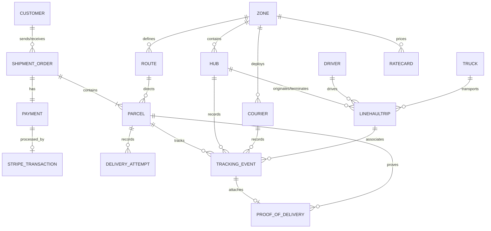

# Database Design, Seeding, and Analytical Queries Report

This report outlines the process of analyzing the business requirements, mapping the Entity-Relationship (E/R) model to a relational database schema, initializing the database, seeding it with 1,000 realistic orders (and their operational dependencies), and running analytical queries to verify system requirements under a **Stripe online payment-only** model.

---

## 1. Entity-Relationship (E/R) Modeling
Based on the logistics and shipping requirements, we modeled the database with **16 entities** (COD_SETTLEMENT was removed) categorized into 5 isolated microservice namespaces.

### Visual Diagram (Mermaid)


---

## 2. Relational Schema DDL
To support clean service isolation (Database-per-Service) while allowing local development on a single PostgreSQL instance, we mapped the E/R model to **5 logical schemas** in a single database. Hard foreign keys exist only *within* service boundaries, while cross-service references are modeled as **logical foreign keys** (simple UUID fields checked at the application level).

The SQL script was written to [init-db.sql](file:///home/dunguyen/Training/nestjs/shipping-system/init-db.sql) and executed successfully.

```sql
-- Create Schemas for Microservices Bounded Contexts
CREATE SCHEMA IF NOT EXISTS shipping_network_db;
CREATE SCHEMA IF NOT EXISTS shipping_pricing_db;
CREATE SCHEMA IF NOT EXISTS shipping_order_db;
CREATE SCHEMA IF NOT EXISTS shipping_courier_db;
CREATE SCHEMA IF NOT EXISTS shipping_tracking_db;

-- 1. shipping_network_db (Hub & Network Topology)
CREATE TABLE shipping_network_db.ZONE (
    id UUID PRIMARY KEY,
    region_code VARCHAR(50) UNIQUE NOT NULL
);

CREATE TABLE shipping_network_db.HUB (
    id UUID PRIMARY KEY,
    zone_id UUID NOT NULL REFERENCES shipping_network_db.ZONE(id),
    name VARCHAR(255) NOT NULL
);

CREATE TABLE shipping_network_db.ROUTE (
    id UUID PRIMARY KEY,
    origin_zone_id UUID NOT NULL REFERENCES shipping_network_db.ZONE(id),
    dest_zone_id UUID NOT NULL REFERENCES shipping_network_db.ZONE(id),
    CONSTRAINT uq_route UNIQUE (origin_zone_id, dest_zone_id)
);

CREATE TABLE shipping_network_db.DRIVER (
    id UUID PRIMARY KEY,
    name_enc VARCHAR(500) NOT NULL
);

CREATE TABLE shipping_network_db.TRUCK (
    id UUID PRIMARY KEY,
    plate VARCHAR(50) UNIQUE NOT NULL
);

CREATE TABLE shipping_network_db.LINEHAULTRIP (
    id UUID PRIMARY KEY,
    origin_hub_id UUID NOT NULL,
    dest_hub_id UUID NOT NULL,
    driver_id UUID,
    truck_id UUID
);

-- 2. shipping_pricing_db (Pricing)
CREATE TABLE shipping_pricing_db.RATECARD (
    id UUID PRIMARY KEY,
    origin_zone_id UUID NOT NULL,
    dest_zone_id UUID NOT NULL,
    parcel_type VARCHAR(50) NOT NULL CHECK (parcel_type IN ('parcel', 'pallet')),
    price_cents INT NOT NULL
);

-- 3. shipping_order_db (Order Management)
CREATE TABLE shipping_order_db.CUSTOMER (
    id UUID PRIMARY KEY,
    name_enc VARCHAR(500) NOT NULL,
    phone_enc VARCHAR(500) NOT NULL,
    address_enc VARCHAR(500) NOT NULL,
    region_code VARCHAR(50) NOT NULL
);

CREATE TABLE shipping_order_db.SHIPMENT_ORDER (
    id UUID PRIMARY KEY,
    sender_id UUID NOT NULL REFERENCES shipping_order_db.CUSTOMER(id),
    recipient_id UUID NOT NULL REFERENCES shipping_order_db.CUSTOMER(id),
    rate_card_id UUID NOT NULL,
    price_cents INT NOT NULL,
    expected_delivery_at TIMESTAMP NOT NULL,
    status VARCHAR(50) NOT NULL CHECK (status IN ('Draft', 'Created', 'Confirmed', 'Active', 'Complete', 'Partially_Delivered', 'Lost', 'Damaged', 'Cancelled'))
);

CREATE TABLE shipping_order_db.PARCEL (
    id UUID PRIMARY KEY,
    shipment_order_id UUID NOT NULL REFERENCES shipping_order_db.SHIPMENT_ORDER(id),
    route_id UUID,
    declared_weight_grams INT NOT NULL CHECK (declared_weight_grams > 0),
    actual_weight_grams INT CHECK (actual_weight_grams > 0),
    type VARCHAR(50) NOT NULL CHECK (type IN ('parcel', 'pallet')),
    direction VARCHAR(50) NOT NULL CHECK (direction IN ('Forward', 'Reverse_RTS')),
    state VARCHAR(50) NOT NULL CHECK (state IN ('Created', 'InHub', 'InTransit', 'Misrouted', 'OutForDelivery', 'Delivered', 'Lost', 'Damaged')),
    sla_expected_delivery TIMESTAMP
);

CREATE TABLE shipping_order_db.PAYMENT (
    id UUID PRIMARY KEY,
    shipment_order_id UUID NOT NULL REFERENCES shipping_order_db.SHIPMENT_ORDER(id) UNIQUE,
    type VARCHAR(50) NOT NULL CHECK (type IN ('PREPAID_STRIPE')),
    amount_cents INT NOT NULL,
    status VARCHAR(50) NOT NULL CHECK (status IN ('Unpaid', 'Paid', 'Awaiting_Settlement'))
);

CREATE TABLE shipping_order_db.STRIPE_TRANSACTION (
    id UUID PRIMARY KEY,
    payment_id UUID NOT NULL REFERENCES shipping_order_db.PAYMENT(id),
    stripe_intent_id VARCHAR(255) UNIQUE NOT NULL,
    stripe_charge_id VARCHAR(255),
    status VARCHAR(50) NOT NULL,
    created_at TIMESTAMP NOT NULL
);

-- 4. shipping_courier_db (Courier Operations)
CREATE TABLE shipping_courier_db.COURIER (
    id UUID PRIMARY KEY,
    zone_id UUID NOT NULL,
    role VARCHAR(50) NOT NULL CHECK (role IN ('Courier', 'HubOperator', 'Dispatcher', 'Admin'))
);

CREATE TABLE shipping_courier_db.PROOF_OF_DELIVERY (
    id UUID PRIMARY KEY,
    scan_event_id UUID UNIQUE NOT NULL,
    parcel_id UUID NOT NULL,
    signature_url VARCHAR(500),
    photo_url VARCHAR(500)
);

CREATE TABLE shipping_courier_db.DELIVERY_ATTEMPT (
    id UUID PRIMARY KEY,
    parcel_id UUID NOT NULL,
    attempt_number INT NOT NULL CHECK (attempt_number BETWEEN 1 AND 3),
    failure_reason VARCHAR(500) NOT NULL,
    created_at TIMESTAMP NOT NULL,
    CONSTRAINT uq_parcel_attempt UNIQUE (parcel_id, attempt_number)
);

-- 5. shipping_tracking_db (Timeline & Audit Logs)
CREATE TABLE shipping_tracking_db.TRACKING_EVENT (
    id UUID PRIMARY KEY,
    parcel_id UUID NOT NULL,
    hub_id UUID,
    courier_id UUID,
    linehaul_trip_id UUID,
    event_type VARCHAR(50) NOT NULL CHECK (event_type IN ('PICKUP', 'HUB_RECEIVE', 'DEPARTED_LINEHAUL', 'ARRIVED_AT_HUB', 'OUT_FOR_DELIVERY', 'DELIVERY_FAILED', 'DELIVERED', 'MISROUTED', 'RTS')),
    created_at TIMESTAMP NOT NULL DEFAULT NOW()
);
```

---

## 3. Database Seeding (1,000 Records)
The updated Python script [generate_seed.py](file:///home/dunguyen/Training/nestjs/shipping-system/generate_seed.py):
1.  Generates zones, hubs, routes, rate cards, drivers, trucks, trips, and couriers.
2.  Generates 500 customers (senders and recipients) with encrypted PII name/phone/address fields.
3.  Generates **1,000 orders** paying only via **PREPAID_STRIPE**.
4.  Attaches parcels (~1,250 total), payments (Stripe), and Stripe transaction logs.
5.  Simulates **operational scan event histories** for each parcel, including:
    *   **Normal Delivery:** `PICKUP` → `HUB_RECEIVE` → `DEPARTED_LINEHAUL` → `ARRIVED_AT_HUB` → `OUT_FOR_DELIVERY` → `DELIVERED`.
    *   **Misrouted Parcels (BR-02):** Includes a `MISROUTED` scan followed by a corrective `HUB_RECEIVE` scan at the destination hub.
    *   **RTS Quay Đầu (BR-04):** Includes 3 failed delivery attempts, an `RTS` scan event, and reverse routing.
    *   **Weight Discrepancy (BR-06):** 15% of parcels have measured hub weights differing from declared weights.

The script generated [seed.sql](file:///home/dunguyen/Training/nestjs/shipping-system/seed.sql) (3.5MB), which was successfully loaded into the PostgreSQL container.

---

## 4. Execution & Analytical Queries

To verify that the database design and seeded data correctly model all business requirements, we ran core queries.

### Query 1: Full Parcel Tracking Timeline (UC-04 / Auditability)
Retrieves the complete history of scan events for a specific parcel, ordered by time.

```sql
SELECT 
    te.created_at,
    te.event_type,
    h.name AS hub_name,
    c.role AS courier_role,
    te.linehaul_trip_id
FROM shipping_tracking_db.TRACKING_EVENT te
LEFT JOIN shipping_network_db.HUB h ON te.hub_id = h.id
LEFT JOIN shipping_courier_db.COURIER c ON te.courier_id = c.id
WHERE te.parcel_id = 'a26c04c4-e840-46b1-b8aa-b15ba8481dad'
ORDER BY te.created_at ASC;
```

**Output:**
```
     created_at      |    event_type     |  hub_name   | courier_role |           linehaul_trip_id           
---------------------+-------------------+-------------+--------------+--------------------------------------
 2026-06-01 02:17:00 | PICKUP            |             | Courier      | 
 2026-06-01 06:17:00 | HUB_RECEIVE       | Hub-REG-101 |              | 
 2026-06-01 14:17:00 | DEPARTED_LINEHAUL |             |              | d3f0834a-76ad-4b15-8222-464172649985
 2026-06-02 00:17:00 | ARRIVED_AT_HUB    | Hub-REG-103 |              | 
 2026-06-02 04:17:00 | OUT_FOR_DELIVERY  |             | Courier      | 
 2026-06-02 06:17:00 | DELIVERED         |             | Courier      | 
(6 rows)
```

---

### Query 2: Identify Misrouted Parcels (BR-02 / UC-12)
Finds parcels that were scanned at incorrect hubs, forcing a corrective re-route sequence.

```sql
SELECT 
    te.parcel_id,
    te.created_at AS misrouted_at,
    h.name AS misrouted_at_hub,
    p.direction,
    p.state AS current_state
FROM shipping_tracking_db.TRACKING_EVENT te
JOIN shipping_network_db.HUB h ON te.hub_id = h.id
JOIN shipping_order_db.PARCEL p ON te.parcel_id = p.id
WHERE te.event_type = 'MISROUTED'
ORDER BY te.created_at DESC
LIMIT 5;
```

**Output:**
```
              parcel_id               |    misrouted_at     | misrouted_at_hub | direction | current_state 
--------------------------------------+---------------------+------------------+-----------+---------------
 3dd33d6c-a37c-4e36-b680-c0335cbda8fb | 2026-07-02 13:42:00 | Hub-REG-100      | Forward   | Delivered
 9d58d209-7af4-4f61-ae77-87ad44db0d0a | 2026-07-02 04:13:00 | Hub-REG-100      | Forward   | Delivered
 47bb5d9c-b935-4e26-b69f-1d421698491d | 2026-06-30 20:24:00 | Hub-REG-100      | Forward   | Delivered
 dcf58362-e87b-4a40-bafb-9073e0e23b7a | 2026-06-29 21:07:00 | Hub-REG-100      | Forward   | Delivered
 b681038b-0adb-4f31-bf77-a62151eae0de | 2026-06-29 07:54:00 | Hub-REG-101      | Forward   | OutForDelivery
```

---

### Query 3: SLA Violation / Passive Lost-Parcel Detection (UC-15)
Finds active in-transit parcels that breached their expected SLA delivery date (candidates for the passive lost-parcel sweep).

```sql
SELECT 
    p.id AS parcel_id,
    p.sla_expected_delivery,
    te.event_type AS latest_scan_type,
    te.created_at AS latest_scan_time
FROM shipping_order_db.PARCEL p
JOIN (
    SELECT DISTINCT ON (parcel_id) parcel_id, event_type, created_at
    FROM shipping_tracking_db.TRACKING_EVENT
    ORDER BY parcel_id, created_at DESC
) te ON p.id = te.parcel_id
WHERE p.state NOT IN ('Delivered', 'Lost', 'Damaged')
  AND p.sla_expected_delivery < NOW()
ORDER BY p.sla_expected_delivery ASC
LIMIT 5;
```

**Output:**
```
              parcel_id               | sla_expected_delivery | latest_scan_type |  latest_scan_time   
--------------------------------------+-----------------------+------------------+---------------------
 3083e32a-8e58-4e57-967e-2263afdb40c5 | 2026-06-02 13:32:00   | ARRIVED_AT_HUB   | 2026-06-03 17:32:00
 d6b21ba1-6a71-4d1a-a0a0-528c5026a821 | 2026-06-02 23:32:00   | OUT_FOR_DELIVERY | 2026-06-03 03:32:00
 592f1d2d-328a-40f0-9e1f-d0893ad90054 | 2026-06-03 16:14:00   | ARRIVED_AT_HUB   | 2026-06-04 20:14:00
 f14bb4ff-810b-49e0-9fea-b3ebf7cc1b06 | 2026-06-03 16:49:00   | HUB_RECEIVE      | 2026-06-01 22:49:00
 94d57b89-aa3a-4dbf-a17b-3a2ef5292bcc | 2026-06-03 18:11:00   | ARRIVED_AT_HUB   | 2026-06-04 22:11:00
```

---

### Query 4: Revenue and Volume by Zone Pairs (Pricing Analytics)
Aggregates shipment volume, total revenue, and average prices for the top 5 origin-destination zone corridors.

```sql
SELECT 
    z_origin.region_code AS origin_zone,
    z_dest.region_code AS dest_zone,
    COUNT(o.id) AS order_count,
    SUM(o.price_cents) / 100.0 AS total_revenue_usd,
    AVG(o.price_cents) / 100.0 AS avg_order_price_usd
FROM shipping_order_db.SHIPMENT_ORDER o
JOIN shipping_pricing_db.RATECARD rc ON o.rate_card_id = rc.id
JOIN shipping_network_db.ZONE z_origin ON rc.origin_zone_id = z_origin.id
JOIN shipping_network_db.ZONE z_dest ON rc.dest_zone_id = z_dest.id
GROUP BY z_origin.region_code, z_dest.region_code
ORDER BY order_count DESC
LIMIT 5;
```

**Output:**
```
 origin_zone | dest_zone | order_count |  total_revenue_usd   | avg_order_price_usd 
-------------+-----------+-------------+----------------------+---------------------
 REG-104     | REG-103   |          24 | 546.7200000000000000 | 22.7800000000000000
 REG-106     | REG-103   |          22 | 472.1200000000000000 | 21.4600000000000000
 REG-106     | REG-104   |          21 | 430.0800000000000000 | 20.4800000000000000
 REG-104     | REG-108   |          21 | 405.0900000000000000 | 19.2900000000000000
 REG-100     | REG-104   |          20 | 391.4000000000000000 | 19.5700000000000000
```

---

### Query 5: Return-to-Sender (RTS) Tracking (BR-04 / UC-13)
Lists parcels currently traveling backwards (`Reverse_RTS` direction) due to reaching the maximum threshold of 3 failed delivery attempts.

```sql
SELECT 
    p.id AS parcel_id,
    p.direction,
    p.state AS current_state,
    (
        SELECT COUNT(*)
        FROM shipping_courier_db.DELIVERY_ATTEMPT
        WHERE parcel_id = p.id
    ) AS failed_attempt_count
FROM shipping_order_db.PARCEL p
WHERE p.direction = 'Reverse_RTS'
ORDER BY failed_attempt_count DESC
LIMIT 5;
```

**Output:**
```
              parcel_id               |  direction  | current_state | failed_attempt_count 
--------------------------------------+-------------+---------------+----------------------
 3083e32a-8e58-4e57-967e-2263afdb40c5 | Reverse_RTS | InHub         |                    3
 592f1d2d-328a-40f0-9e1f-d0893ad90054 | Reverse_RTS | InHub         |                    3
 94d57b89-aa3a-4dbf-a17b-3a2ef5292bcc | Reverse_RTS | InHub         |                    3
 630d5817-b6f0-418d-8f6a-2370e162f72d | Reverse_RTS | InHub         |                    3
 ae6b798e-d62b-481a-b593-386e987ebb83 | Reverse_RTS | InHub         |                    3
```
