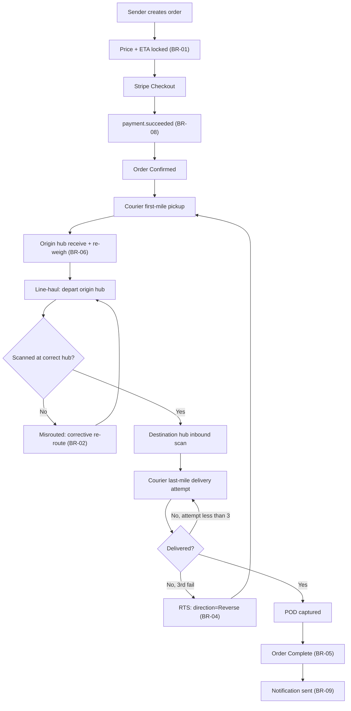

# Specification

## Overview

The Domestic Parcel Shipping System is engineered based on the Hub-and-Spoke Consolidation Model utilizing a NestJS microservices architecture and a NATS event backbone.

In domestic logistics, directly transporting a small parcel from a Sender in Province A to a Recipient in Province B on a point-to-point basis is economically unviable and structurally unscalable. This system is specifically designed to solve the core operational bottleneck: coordinating a Many-to-One-to-Many physical flow.

The system optimizes network efficiency and minimizes per-unit logistics costs through a structured three-phase pipeline:

- **Consolidation (First-mile)**: Local pickup drivers gather individual parcels and bring them to a local Origin Hub.
- **Line-Haul Transport**: High-capacity long-haul trucks transport these parcels over long distances between major inter-provincial hubs (Origin Hub → Destination Hub).
- **Deconsolidation & Last-Mile**: At the destination hub, parcels are separated and assigned to local delivery drivers (vans or motorcycles) for final delivery to the end recipient.

## Aggregation Hierarchy

To eliminate structural ambiguity between physical entities, the system enforces a strict data topology:

`Parcel -> Trip (Line-Haul Trip)`

- **Parcel**: The individual unit of shipment.
- **Trip (Line-Haul Trip)**: The scheduled journey of a vehicle carrying parcels between hubs.
- **Note on Scoped Slice**: Physical consolidation (Bags and Manifests) is out of scope for the database model in this MVP slice. Tracking is managed at the individual Parcel level, and trips directly reference the constituent parcels being transported. See [docs/05-analysis.md](file:///home/dunguyen/Training/nestjs/shipping-system/docs/05-analysis.md) for the original, pre-cut hierarchy.

## End-to-End User Experience Flow

The system abstracts all physical routing and consolidation complexities from the user. This is the same flow as the "Parcel Lifecycle" in [docs/04-business-rules.md](file:///home/dunguyen/Training/nestjs/shipping-system/docs/04-business-rules.md), presented here as a diagram with the exception branches (Misrouted, RTS) shown alongside the happy path rather than listed separately.

1. **Order Creation**: Sender creates the order; price and ETA are locked (BR-01).
2. **Payment Gate**: Stripe checkout is completed, and we wait for `payment.succeeded` before the order is `Confirmed` (BR-08). No pickup or hub inbound is accepted before this gate clears.
3. **First-Mile & Origin Hub**: Courier picks up the parcel; origin hub receives and re-weighs it, reconciling any weight discrepancy downstream rather than holding the parcel (BR-06).
4. **Line-Haul & Routing Guard**: The parcel travels hub-to-hub. A wrong-hub scan is caught immediately, flips the parcel to `Misrouted`, and triggers a corrective re-route instead of silently continuing (BR-02).
5. **Last-Mile Delivery**: Courier attempts delivery. Success captures a Proof of Delivery. Failure retries up to 3 times, after which the parcel automatically enters Return-to-Sender, keeping its tracking ID (BR-04).
6. **Completion & Notification**: Once every parcel in the order reaches a terminal state, `SHIPMENT_ORDER.status` becomes `Complete` (BR-05) and a best-effort email notification fires (BR-09).

### Visual Diagram (Mermaid)

## Business Rules

Rules are grouped by operational area (Order & Parcel, Tracking & Scan Events, Delivery & Exceptions) with an enforcement point each — a database constraint, service-layer logic, or a state-machine guard.

> See [docs/04-business-rules.md](file:///home/dunguyen/Training/nestjs/shipping-system/docs/04-business-rules.md) for the full, authoritative BR-01–BR-09 catalogue and the parcel lifecycle / exception branches derived from it — kept in one place to avoid drift with the summary above.

## Functional Requirements

- Authentication & Authorization: All actors authenticate via Clerk (session JWT verified at the API gateway; implemented). Role-based access — `customer` places/tracks own orders, `shipper` picks up/delivers, `hub_staff` runs warehouse scans, `dispatcher` assigns trips/legs, `admin` unrestricted — enforced at the gateway per [docs/10-authz-plan.md](./10-authz-plan.md).
- Order Management: Capture order payloads containing sender/recipient profiles, multi-parcel details, and locked pricing/ETA.
- Stripe Online Checkout: Process prepaid orders using Stripe Checkout sessions and handle webhook callbacks (BR-08).
- First/Last-Mile Dispatch: Route pickup and delivery tasks to local couriers.
- Real-Time Tracking Ledger: Emit and persist timestamped events at every network node scan.
- Mailer Notifications: Best-effort email dispatch via a stateless NATS consumer (no dedicated data store, no retry) on key lifecycle events (BR-09).
- Exception Workflows: Handle delivery retry limits, RTS loops, and misrouted parcel re-routing.

## Non-Functional Requirements

*(Canonical source — do not duplicate this table elsewhere; other docs link here instead.)*

| Attribute | Target Metric / Operational Note |
| :--- | :--- |
| Auditability | 100% append-only scan event log; database-level modifications to historical entries are blocked. |
| Throughput | The system must handle a peak sustained throughput of 2,500 scans/second without performance degradation. |
| Latency | End-consumer order status queries must return responses in under 300 ms at P99 (served from Redis). |
| Consistency | Strong transactional consistency (ACID) within single service boundaries. Eventual consistency across services via NATS JetStream. |
| Security | Field-level encryption (AES-256-GCM) for PII data; Clerk JWT authentication at the gateway (implemented) with spoof-proof identity header propagation; Role-Based Access Control (RBAC) per [docs/10-authz-plan.md](./10-authz-plan.md). |
