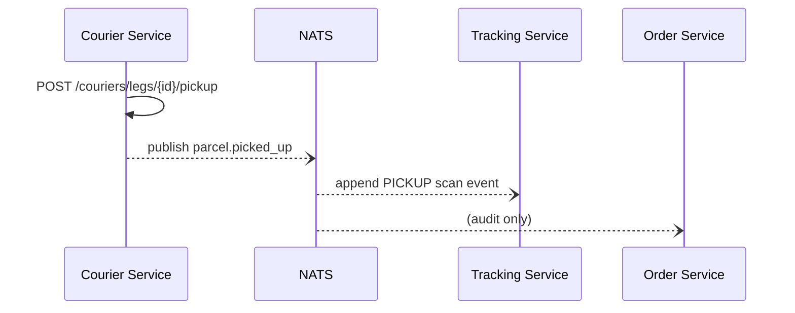
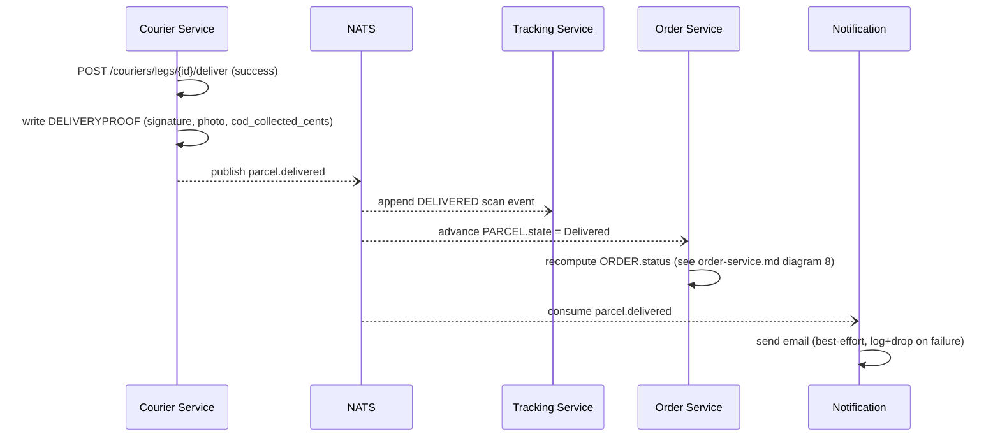
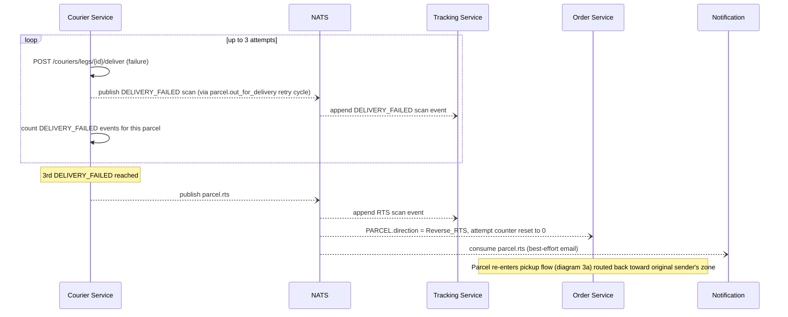
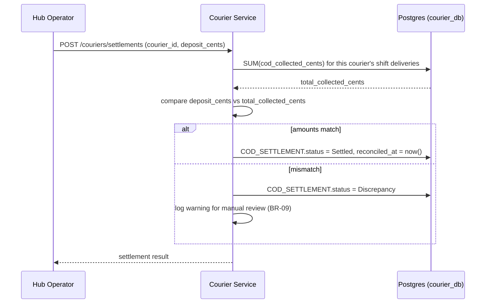

# LLD — Courier Service

## Versioning

| Version | Date | Author | Changes |
| :--- | :--- | :--- | :--- |
| v1.0 | 2026-07-03 | Du Nguyen | Initial split from monolithic LLD |

Owns: `COURIER`, `DELIVERYPROOF`, `COD_SETTLEMENT`, `DELIVERY_ATTEMPT`. Conventions in [00-conventions.md](file:///home/dunguyen/Training/nestjs/shipping-system/docs/lld/00-conventions.md) apply — including the `Idempotency-Key` header on every `POST` below (particularly important here: a retried `/deliver` call must not double-count a `DELIVERY_ATTEMPT` or double-collect COD cash). This service never writes `SCANEVENT` directly — it publishes NATS events and Tracking appends the row (see [docs/02-HLD.md § Accepted MVP risk](file:///home/dunguyen/Training/nestjs/shipping-system/docs/02-HLD.md) for the no-outbox trade-off on this path).

## Key Design Decisions

- **No outbox on any endpoint here** (accepted MVP risk, see link above) — the DB write and the NATS publish happen in the same request with no transactional guarantee between them.
- **COD is captured atomically, reconciled asynchronously**: cash amount is recorded at the moment of delivery scan (`DELIVERYPROOF.cod_collected_cents`), but it isn't verified against physical cash until end-of-shift settlement (BR-09) — two different points in time, two different endpoints.
- **3-strike RTS counter resets on reverse leg**: `DELIVERY_ATTEMPT` numbering restarts at 1 after `parcel.rts` fires, so the reverse-leg delivery gets its own independent 3 attempts (BR-04).

## Use Cases

| UC | Use Case | Actor | Trigger | Main Outcome | Related BR |
| :--- | :--- | :--- | :--- | :--- | :--- |
| UC-05 | Record Pickup Scan | Courier | Courier picks up parcel from sender | `PICKUP` scan event appended | — |
| UC-06 | Record Delivery Attempt | Courier | Courier attempts last-mile delivery | `DELIVERED` (+ POD, + COD cash) or `DELIVERY_FAILED` scan event | BR-04 |
| UC-08 | Register COD Deposit | Hub Operator | Courier hands over cash at end of shift | `COD_SETTLEMENT` created and reconciled | BR-09 |
| UC-13 | Trigger RTS After 3 Failures | System | 3rd `DELIVERY_FAILED` for a parcel | `direction = Reverse_RTS`, attempt counter reset | BR-04 |

### UC-06 + UC-13 — Delivery Attempt & RTS After 3 Failures

- **Preconditions**: Parcel is `OutForDelivery`; a courier leg exists.
- **Postconditions (success)**: `DELIVERED` scan event + `DELIVERYPROOF` row; `ORDER.status` eventually `Complete`.
- **Main flow**: Courier calls `POST /couriers/legs/{id}/deliver` with POD (+ COD amount if applicable) → `parcel.delivered` published → Tracking appends scan, Order advances state, Notification fires.
- **Alternate flow (failed attempt)**: Courier calls the same endpoint with a failure reason → `DELIVERY_FAILED` scan appended → this service counts attempts for the parcel.
- **Exception flow (3rd failure)**: On the 3rd `DELIVERY_FAILED`, this service emits `parcel.rts` instead of re-dispatching → `PARCEL.direction = Reverse_RTS`, attempt counter resets to zero for the reverse leg, tracking ID unchanged (BR-04) → parcel re-enters the flow at UC-05 (pickup-equivalent) headed back to the original sender's zone.

### UC-08 — Register COD Deposit & Reconcile

- **Preconditions**: Courier has completed a shift with one or more COD deliveries.
- **Postconditions (success)**: `COD_SETTLEMENT.status = Settled`, `reconciled_at` set.
- **Main flow**: Hub Operator calls `POST /couriers/settlements` with the courier's cash deposit amount → this service sums `cod_collected_cents` across that courier's COD deliveries for the shift → compares to the deposit.
- **Alternate flow (mismatch)**: amounts don't match → `COD_SETTLEMENT.status = Discrepancy`, warning logged for manual review (BR-09) — does not block the courier's next shift.

## Sequence Diagrams

### 3a. First-Mile Pickup

*(Hub inbound + weight reconciliation, the other half of this physical step, is owned by [hub-service.md](file:///home/dunguyen/Training/nestjs/shipping-system/docs/lld/hub-service.md).)*

### 5. Last-Mile Delivery Success (POD + COD + Notification)

### 6. RTS After 3 Failed Delivery Attempts

### 7. COD Settlement & Reconciliation

## API Contracts

### `POST /couriers/legs/{id}/pickup`

| Field | Type | Validation |
| :--- | :--- | :--- |
| `parcel_id` | uuid | required, must belong to an order in `Confirmed`+ status (BR-08 guard) |
| `courier_id` | uuid | required, must be an active courier |

**Response `201`**: `{ scan_event_id, created_at }`. **Errors**: `404` parcel/courier not found · `422 BR-08` parent order not yet `Confirmed`.

### `POST /couriers/legs/{id}/deliver`

| Field | Type | Validation |
| :--- | :--- | :--- |
| `outcome` | enum | `DELIVERED`, `FAILED` |
| `signature_url` | string, nullable | required if `outcome=DELIVERED` |
| `photo_url` | string, nullable | optional |
| `cod_collected_cents` | int, nullable | required if `outcome=DELIVERED` and order is COD; must equal `PARCEL` price ± BR-06 reconciled delta |
| `failure_reason` | string, nullable | required if `outcome=FAILED` |

**Response `201`**: `{ scan_event_id, parcel_state }`. **Errors**: `404` leg/parcel not found · `422 BR-04` a 4th delivery attempt submitted after RTS already triggered — must be routed as a reverse-leg attempt instead.

**Side effect on failure**: writes a `DELIVERY_ATTEMPT` row (`attempt_number` 1–3); on the 3rd, emits `parcel.rts` instead of allowing a 4th `OUT_FOR_DELIVERY` (BR-04).

### `POST /couriers/settlements`

| Field | Type | Validation |
| :--- | :--- | :--- |
| `courier_id` | uuid | required, must have ≥1 undeposited COD delivery |
| `deposit_cents` | int | ≥ 0 |
| `shift_date` | date | required |

**Response `201`**: `{ settlement_id, status: "Settled"\|"Discrepancy", expected_cents, deposit_cents }`. **Errors**: `404` courier not found · `409` a settlement for this courier + shift_date already exists.

## Database Schema Detail

| Entity | Indexes | Constraints |
| :--- | :--- | :--- |
| `COURIER` | `idx_courier_zone_id` | PK `id` |
| `DELIVERYPROOF` | `idx_deliveryproof_parcel_id` | PK `id` · UNIQUE `scan_event_id` (one proof per `DELIVERED` event) |
| `COD_SETTLEMENT` | `idx_cod_settlement_courier_id` | PK `id` · UNIQUE `(courier_id, shift_date)` (BR-09: one settlement per courier per shift) |
| `DELIVERY_ATTEMPT` | `idx_delivery_attempt_parcel_id` | PK `id` · UNIQUE `(parcel_id, attempt_number)` · CHECK `attempt_number BETWEEN 1 AND 3` |
