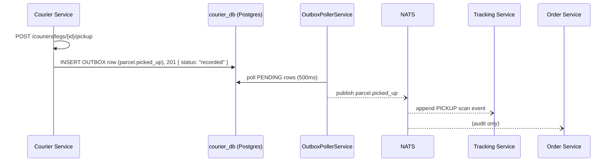
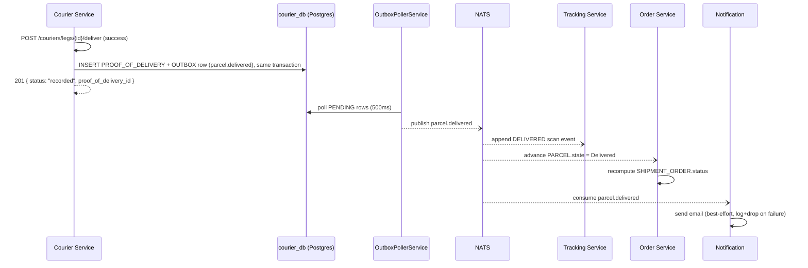
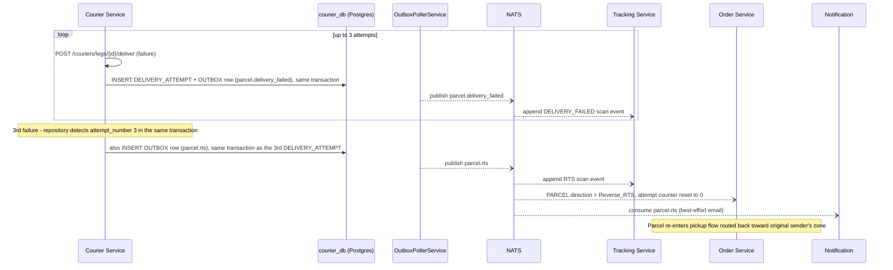

# LLD — Courier Service

## Versioning

| Version | Date | Author | Changes |
| :--- | :--- | :--- | :--- |
| v1.5 | 2026-07-17 | Du Nguyen | Task 10.1: added `COURIER.user_id` (varchar 64, nullable, unique index) — the Clerk user id of the shipper account operating as this courier, provisioned via `scripts/link-courier-user.js`. Identity link only; ownership enforcement on `/pickup`/`/deliver` is task 10.2. |
| v1.4 | 2026-07-14 | Du Nguyen | Task 6.1 follow-up: replaced the synchronous in-request NATS publish with a Transactional Outbox (`shipping_courier_db.OUTBOX`, same shape/poller pattern as Order Service's, task 5.6) — a publish failure no longer loses the event, and an `Idempotency-Key` retry after a failed publish can no longer double-write `PROOF_OF_DELIVERY`/`DELIVERY_ATTEMPT`, since the business row and the outbox row now commit atomically in one Postgres transaction and the publish itself happens async, outside the request. API responses changed accordingly (see API Contracts): they no longer return `event`/`event_id`/`published_at` (those implied a synchronous publish that no longer happens), only `status: "recorded"` plus whatever this service's own DB write produced. |
| v1.3 | 2026-07-14 | Du Nguyen | Task 6.1 implementation: added `DELIVERY_ATTEMPT.direction` — the original schema's `UNIQUE(parcel_id, attempt_number)` couldn't support BR-04's documented "counter resets to zero for the reverse leg" without colliding with the forward leg's own rows 1-3 for the same `parcel_id`. `UNIQUE` is now `(parcel_id, direction, attempt_number)`. Also added the missing `DEFAULT NOW()` on `DELIVERY_ATTEMPT.created_at` (every other table's `created_at` has it; this one didn't, caught by live verification when `TypeORM`'s `@CreateDateColumn`-backed insert relied on the DB default and got a `NOT NULL` violation instead). |
| v1.2 | 2026-07-08 | Du Nguyen | Same root cause as v1.1, applied to API responses: `POST /pickup` and `POST /deliver` claimed to synchronously return `tracking_event_id` (and `/deliver` also `parcel_state`), but neither `TRACKING_EVENT` nor `PARCEL.state` is written by this service — both are updated asynchronously by other services after consuming the published NATS event. Responses now return only what this service knows synchronously (`event`, `event_id`, `published_at`, and its own local rows), matching the pattern already used in `linehaul-service.md`'s `/depart`/`/arrive`. |
| v1.1 | 2026-07-08 | Du Nguyen | Removed `PROOF_OF_DELIVERY.tracking_event_id` — it could never be correctly written: this service writes the row synchronously, before Tracking (a different, async, cross-schema service) has appended the corresponding `DELIVERED` `TRACKING_EVENT` row. `parcel_id` is the sole, correct join key. |
| v1.0 | 2026-07-03 | Du Nguyen | Initial split from monolithic LLD |

Owns: `COURIER`, `PROOF_OF_DELIVERY`, `DELIVERY_ATTEMPT`, `OUTBOX`. Conventions in [00-conventions.md](file:///home/dunguyen/Training/nestjs/shipping-system/docs/lld/00-conventions.md) apply — including the `Idempotency-Key` header on every `POST` below (particularly important here: a retried `/deliver` call must not double-count a `DELIVERY_ATTEMPT`). This service never writes `TRACKING_EVENT` directly — it publishes NATS events (via its own Outbox + poller, as of v1.4) and Tracking appends the row.

## Key Design Decisions

- **Transactional Outbox on every write endpoint** (as of v1.4, same pattern as Order Service task 5.6): each business write (`PROOF_OF_DELIVERY` insert, `DELIVERY_ATTEMPT` insert) and its corresponding `OUTBOX` row commit in the same Postgres transaction; a background poller (`OutboxPollerService`, 500ms interval) publishes `PENDING` rows to NATS and marks them `PUBLISHED`. A publish failure is retried on the next poll tick rather than lost, and a client `Idempotency-Key` retry can never re-run a write whose outbox row already exists.
- **3-strike RTS counter resets on reverse leg**: `DELIVERY_ATTEMPT` numbering restarts at 1 after `parcel.rts` fires, so the reverse-leg delivery gets its own independent 3 attempts (BR-04).

## Use Cases

| UC | Use Case | Actor | Trigger | Main Outcome | Related BR |
| :--- | :--- | :--- | :--- | :--- | :--- |
| UC-05 | Record Pickup Scan | Courier | Courier picks up parcel from sender | `PICKUP` scan event appended | — |
| UC-06 | Record Delivery Attempt | Courier | Courier attempts last-mile delivery | `DELIVERED` (+ POD) or `DELIVERY_FAILED` scan event | BR-04 |
| UC-13 | Trigger RTS After 3 Failures | System | 3rd `DELIVERY_FAILED` for a parcel | `direction = Reverse_RTS`, attempt counter reset | BR-04 |

### UC-06 + UC-13 — Delivery Attempt & RTS After 3 Failures

- **Preconditions**: Parcel is `OutForDelivery`; a courier leg exists.
- **Postconditions (success)**: `DELIVERED` scan event + `PROOF_OF_DELIVERY` row; `SHIPMENT_ORDER.status` eventually `Complete`.
- **Main flow**: Courier calls `POST /couriers/legs/{id}/deliver` with POD → `parcel.delivered` published → Tracking appends scan, Order advances state, Notification fires.
- **Alternate flow (failed attempt)**: Courier calls the same endpoint with a failure reason → `DELIVERY_FAILED` scan appended → this service counts attempts for the parcel.
- **Exception flow (3rd failure)**: On the 3rd `DELIVERY_FAILED`, this service emits `parcel.rts` instead of re-dispatching → `PARCEL.direction = Reverse_RTS`, attempt counter resets to zero for the reverse leg, tracking ID unchanged (BR-04) → parcel re-enters the flow at UC-05 (pickup-equivalent) headed back to the original sender's zone.

## Sequence Diagrams

### 3a. First-Mile Pickup

*(Hub inbound + weight reconciliation, the other half of this physical step, is owned by [hub-service.md](file:///home/dunguyen/Training/nestjs/shipping-system/docs/lld/hub-service.md).)*

### 5. Last-Mile Delivery Success (POD + Notification)

### 6. RTS After 3 Failed Delivery Attempts

## API Contracts

### `POST /couriers/legs/{id}/pickup`

| Field | Type | Validation |
| :--- | :--- | :--- |
| `parcel_id` | uuid | required, must belong to an order in `Confirmed`+ status (BR-08 guard) |
| `courier_id` | uuid | required, must be an active courier |

**Response `201`**: `{ status: "recorded" }` — the `parcel.picked_up` publish is now async via the Outbox/poller (v1.4), so there is no `event_id`/`published_at` to return synchronously; this service also never creates `TRACKING_EVENT` itself (Tracking does, after consuming the event). **Errors**: `404` parcel/courier not found · `422 BR-08` parent order not yet `Confirmed`.

### `POST /couriers/legs/{id}/deliver`

| Field | Type | Validation |
| :--- | :--- | :--- |
| `outcome` | enum | `DELIVERED`, `FAILED` |
| `signature_url` | string, nullable | required if `outcome=DELIVERED` |
| `photo_url` | string, nullable | optional |
| `failure_reason` | string, nullable | required if `outcome=FAILED` |

**Response `201`** — the underlying `parcel.delivered`/`parcel.delivery_failed`/`parcel.rts` publishes are now async via the Outbox/poller (v1.4), so responses only report this service's own synchronous DB write, never `event_id`/`published_at`:
- `outcome=DELIVERED`: `{ status: "recorded", proof_of_delivery_id }` (`proof_of_delivery_id` is known — this service writes `PROOF_OF_DELIVERY` in the same request/transaction).
- `outcome=FAILED`: `{ status: "recorded", delivery_attempt_id, attempt_number, rts_triggered }` (`rts_triggered` is `true` only on the 3rd consecutive failure, BR-04).

**Errors**: `404` leg/parcel not found · `422 BR-04` a 4th delivery attempt submitted after RTS already triggered — must be routed as a reverse-leg attempt instead.

**Side effect on failure**: writes a `DELIVERY_ATTEMPT` row (`attempt_number` 1–3); on the 3rd, emits `parcel.rts` instead of allowing a 4th `OUT_FOR_DELIVERY` (BR-04).

## Database Schema Detail

| Entity | Indexes | Constraints |
| :--- | :--- | :--- |
| `COURIER` | `idx_courier_zone_id`, `idx_courier_user_id` (unique) | PK `id` · `user_id` nullable Clerk user id (unique when set) |
| `PROOF_OF_DELIVERY` | `idx_proof_of_delivery_parcel_id` | PK `id`. No `tracking_event_id` column: this row is written synchronously by this service, before Tracking (async, cross-schema) has appended the `DELIVERED` row, so there is no ID to reference at write time — see `docs/01-ERD.md` PARCEL↔PROOF_OF_DELIVERY note. |
| `DELIVERY_ATTEMPT` | `idx_delivery_attempt_parcel_id` | PK `id` · UNIQUE `(parcel_id, direction, attempt_number)` · CHECK `attempt_number BETWEEN 1 AND 3` · `direction` (`Forward`\|`Reverse_RTS`, mirrors `PARCEL.direction`) scopes the counter so a reverse leg's reused 1-3 numbering never collides with the forward leg's rows (BR-04's "resets to zero") |
| `OUTBOX` | `idx_courier_outbox_status_created_at` (partial, `WHERE status = 'PENDING'`) | PK `id` · UNIQUE `event_id`. Same shape as `shipping_order_db.OUTBOX`; local to this service's schema (ADR-003), not shared. |
