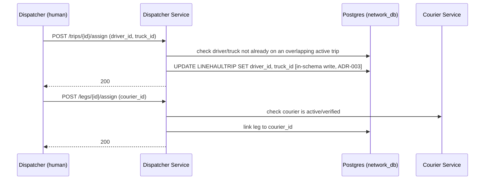

# LLD — Dispatcher Service

## Versioning

| Version | Date | Author | Changes |
| :--- | :--- | :--- | :--- |
| v1.2 | 2026-07-15 | Du Nguyen | Task 7.3: **real gap found and fixed, confirmed with user first** — `parcel.out_for_delivery` had a registered consumer in Order/Tracking but zero publishers anywhere (found while writing `docs/07-e2e-walkthrough.md`, task 7.2), so `PARCEL.state` could never reach `OutForDelivery`/`Delivered`. `POST /legs/{id}/assign` now publishes it (courier assignment onto the final leg *is* the moment a parcel becomes ready for last-mile dispatch) via a new Outbox — Dispatcher gains one, sharing the same physical `shipping_network_db.outbox` table Hub (6.2)/Line-haul (6.4) already use, same precedent. `libs/contracts`'s `ParcelOutForDeliveryEventV1` docblock previously said "Published by Courier" — never implemented anywhere, predates the per-service split; fixed to say Dispatcher. |
| v1.1 | 2026-07-15 | Du Nguyen | Task 6.5 implementation (this file was never updated when 6.5 shipped — backfilled here): `COURIER.status` added (real gap, same class as `LINEHAULTRIP.status`) so the `422` guard below has something to check; `/legs/{id}/assign` confirmed **validation-only, no persistence** — no `LEG` table or `PARCEL.courier_id` exists anywhere in the ERD, and Courier Service's pickup/deliver already take `courier_id` directly. Cross-schema reads (`COURIER`, `PARCEL`) use named TypeORM connections, same pattern as Courier Service's own `IOrderLookupPort`. |
| v1.0 | 2026-07-03 | Du Nguyen | Initial split from monolithic LLD |

Owns: `DRIVER`, `TRUCK` (assignment), and (as of v1.2) an `OUTBOX` row per `/legs/{id}/assign` call. Conventions in [00-conventions.md](file:///home/dunguyen/Training/nestjs/shipping-system/docs/lld/00-conventions.md) apply — including `Idempotency-Key` on both endpoints below (a retried assign call must not silently reassign an already-assigned trip/leg to a different driver/courier). Dispatcher writes the *assignment* — driver/truck onto a trip that Line-haul already created, and a courier onto a leg — it does not create trips itself (see [linehaul-service.md](file:///home/dunguyen/Training/nestjs/shipping-system/docs/lld/linehaul-service.md)).

## Key Design Decisions

- **In-schema write, not a cross-service call**: this service writes directly into `LINEHAULTRIP` (a Line-haul-owned table) because both live in the shared `shipping_network_db` for this slice (ADR-003). This is only safe because it's a shared schema — it would need to become a sync call or event if the services ever split databases.
- **No persisted assignment row, but does publish an event (v1.2)**: `/legs/{id}/assign` still writes no `LEG`/assignment table (confirmed v1.1 decision stands — nothing downstream reads a persisted assignment), but as of v1.2 it does publish `parcel.out_for_delivery` via a new Outbox, once the courier is validated. Persistence and event-publication are separate concerns; the v1.1 decision was about the former only.

## Use Cases

| UC | Use Case | Actor | Note | Related BR |
| :--- | :--- | :--- | :--- | :--- |
| UC-09 | Assign Driver/Truck to Trip | Dispatcher | Assignment part only — creation is [Line-haul Service's](file:///home/dunguyen/Training/nestjs/shipping-system/docs/lld/linehaul-service.md) | — |
| UC-10 | Assign Courier to Leg | Dispatcher | | — |

## Sequence Diagrams

### 10b. Trip & Leg Assignment

*(This diagram was added while writing this LLD — no sequence diagram previously covered UC-09/UC-10 at all. Trip creation, the prerequisite step, is owned by [linehaul-service.md](file:///home/dunguyen/Training/nestjs/shipping-system/docs/lld/linehaul-service.md), Diagram 10a.)*

## API Contracts

### `POST /trips/{id}/assign`

| Field | Type | Validation |
| :--- | :--- | :--- |
| `driver_id` | uuid | required, must exist |
| `truck_id` | uuid | required, must exist |

**Response `200`**. **Errors**: `404` trip/driver/truck not found · `409` driver or truck already assigned to an overlapping active trip.

### `POST /legs/{id}/assign`

| Field | Type | Validation |
| :--- | :--- | :--- |
| `courier_id` | uuid | required |

**Response `200`**. **Errors**: `404` leg/courier not found · `422` courier not active/verified. On success (v1.2), publishes `parcel.out_for_delivery` (`parcel_id`, `courier_id`) via the Outbox — async, does not delay the response.

## Database Schema Detail

| Entity | Indexes | Constraints |
| :--- | :--- | :--- |
| `DRIVER` | — | PK `id` |
| `TRUCK` | UNIQUE `plate` | PK `id` |
| `OUTBOX` (v1.2) | — | Shared physical table with Hub (task 6.2)/Line-haul (task 6.4) — see the Owns note above. |

No table is exclusively owned by Dispatcher for writes beyond `DRIVER`/`TRUCK` themselves — the assignment fields it writes (`LINEHAULTRIP.driver_id`, `LINEHAULTRIP.truck_id`) live in Line-haul's table, and `COURIER.status` (v1.1) is read-only here. Because this slice uses a shared schema for the network group (`shipping_network_db`, ADR-003), this is an in-schema write, not a cross-service call.
