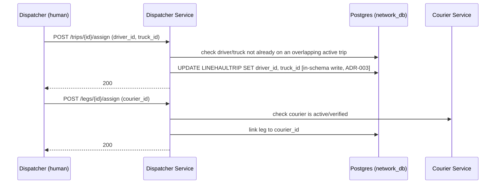

# LLD — Dispatcher Service

## Versioning

| Version | Date | Author | Changes |
| :--- | :--- | :--- | :--- |
| v1.0 | 2026-07-03 | Du Nguyen | Initial split from monolithic LLD |

Owns: `DRIVER`, `TRUCK` (assignment). Conventions in [00-conventions.md](file:///home/dunguyen/Training/nestjs/shipping-system/docs/lld/00-conventions.md) apply — including `Idempotency-Key` on both endpoints below (a retried assign call must not silently reassign an already-assigned trip/leg to a different driver/courier). Dispatcher writes the *assignment* — driver/truck onto a trip that Line-haul already created, and a courier onto a leg — it does not create trips itself (see [linehaul-service.md](file:///home/dunguyen/Training/nestjs/shipping-system/docs/lld/linehaul-service.md)).

## Key Design Decisions

- **In-schema write, not a cross-service call**: this service writes directly into `LINEHAULTRIP` (a Line-haul-owned table) because both live in the shared `shipping_network_db` for this slice (ADR-003). This is only safe because it's a shared schema — it would need to become a sync call or event if the services ever split databases.
- **No exclusive table of its own beyond `DRIVER`/`TRUCK`**: this service's core responsibility (assignment) is expressed as writes to *other* services' tables, which is why it has the thinnest "Owns" list in the system.

## Use Cases

| UC | Use Case | Actor | Note | Related BR |
| :--- | :--- | :--- | :--- | :--- |
| UC-09 | Assign Driver/Truck to Trip | Dispatcher | Assignment part only — creation is [Line-haul Service's](file:///home/dunguyen/Training/nestjs/shipping-system/docs/lld/linehaul-service.md) | — |
| UC-10 | Assign Courier to Leg | Dispatcher | | — |

## Sequence Diagrams

### 10b. Trip & Leg Assignment

*(This diagram was added while writing this LLD — no sequence diagram previously covered UC-09/UC-10 at all. Trip creation, the prerequisite step, is owned by [linehaul-service.md](file:///home/dunguyen/Training/nestjs/shipping-system/docs/lld/linehaul-service.md), Diagram 10a.)*

## API Contracts

### `POST /trips/{id}/assign`

| Field | Type | Validation |
| :--- | :--- | :--- |
| `driver_id` | uuid | required, must exist |
| `truck_id` | uuid | required, must exist |

**Response `200`**. **Errors**: `404` trip/driver/truck not found · `409` driver or truck already assigned to an overlapping active trip.

### `POST /legs/{id}/assign`

| Field | Type | Validation |
| :--- | :--- | :--- |
| `courier_id` | uuid | required |

**Response `200`**. **Errors**: `404` leg/courier not found · `422` courier not active/verified.

## Database Schema Detail

| Entity | Indexes | Constraints |
| :--- | :--- | :--- |
| `DRIVER` | — | PK `id` |
| `TRUCK` | UNIQUE `plate` | PK `id` |

No table is exclusively owned by Dispatcher for writes beyond `DRIVER`/`TRUCK` themselves — the assignment fields it writes (`LINEHAULTRIP.driver_id`, `LINEHAULTRIP.truck_id`) live in Line-haul's table. Because this slice uses a shared schema for the network group (`shipping_network_db`, ADR-003), this is an in-schema write, not a cross-service call.
