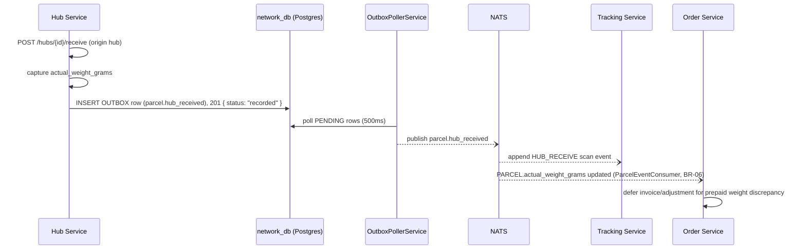
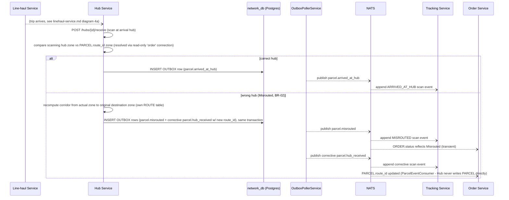

# LLD — Hub / Sortation Service

## Versioning

| Version | Date | Author | Changes |
| :--- | :--- | :--- | :--- |
| v1.2 | 2026-07-14 | Du Nguyen | Task 6.2 implementation: built with a Transactional Outbox from day 1 (`shipping_network_db.OUTBOX`, same pattern retrofitted onto Courier in task 6.1) — responses now return `{ status: "recorded" }`, not `event`/`event_id`/`published_at` (those implied a synchronous publish this service never does). **Real gap found and fixed, confirmed with user first**: `PARCEL.route_id` was never populated at real order creation (only seed data had it), which would have made BR-02 misroute detection untestable against a live order — extended `IPricingPort`/`RateCardPricingAdapter` (Order Service) to resolve and persist it. **Cross-schema write resolved via the existing convention**: Hub computes the corrective route on a misrouted scan but never writes `PARCEL` directly (`route_id`/`actual_weight_grams` are Order-owned columns) — it republishes a corrective `parcel.hub_received` with the new `route_id`, and Order's `ParcelEventConsumer` (extended this task) applies both fields. |
| v1.1 | 2026-07-08 | Du Nguyen | `POST /hubs/{id}/receive` claimed to synchronously return `tracking_event_id`, but this service never writes `TRACKING_EVENT` — Tracking does, asynchronously, after consuming the published event. Response now returns `event`/`event_id`/`published_at` (what this service actually knows), matching `linehaul-service.md`'s `/depart`/`/arrive` pattern. |
| v1.0 | 2026-07-03 | Du Nguyen | Initial split from monolithic LLD |

Owns: `ZONE`, `ROUTE`, `HUB`, `OUTBOX`. Conventions in [00-conventions.md](file:///home/dunguyen/Training/nestjs/shipping-system/docs/lld/00-conventions.md) apply — including the `Idempotency-Key` header on `POST /hubs/{id}/receive` (a retried scan must not append a duplicate `SCANEVENT` or re-trigger misrouted correction). Bag/manifest consolidation is physical-only and not modeled (see `CLAUDE.md § SCOPE`).

## Key Design Decisions

- **Transactional Outbox from day 1** (as of v1.2): the misrouted + corrective-republish case writes 2 `OUTBOX` rows atomically in one Postgres transaction; a background poller (`OutboxPollerService`, 500ms interval) publishes `PENDING` rows to NATS.
- **Misrouted detection is inline, not a separate step**: the zone-mismatch check and the corrective re-route both happen inside the same `/receive` request handler — there's no intermediate "pending review" state for a misrouted scan (BR-02).
- **`event_type` is server-computed**: the client only reports *that* a scan happened; whether it's `HUB_RECEIVE`, `ARRIVED_AT_HUB`, or `MISROUTED` is decided by this service based on `PARCEL.route_id` vs. the scanning hub's zone, not passed by the caller.
- **No manifest/bag state to reconcile**: unlike a full hub-and-spoke system, this service's inbound scan is a single flat event per parcel — deliberately, per the scope cut (ADR-004 family of decisions).
- **Hub never writes `PARCEL` directly**: `route_id`/`actual_weight_grams` are Order-owned columns (`shipping_order_db.PARCEL`); Hub only reads them (read-only `'order'` connection, same pattern as Courier/Tracking) and resolves the corrective route via its own `ROUTE` table, then republishes the corrective `parcel.hub_received` carrying `route_id` for Order's `ParcelEventConsumer` to apply.

## Use Cases

| UC | Use Case | Actor | Trigger | Main Outcome | Related BR |
| :--- | :--- | :--- | :--- | :--- | :--- |
| UC-07 | Receive Parcel at Hub | Hub Operator | Parcel arrives at any hub (origin, transit, or destination) | `HUB_RECEIVE` / `ARRIVED_AT_HUB` scan event; weight captured | BR-02, BR-06 |
| UC-12 | Detect Misrouted Parcel | System | Hub scan zone ≠ expected route zone | `parcel.misrouted` published; corrective re-route computed | BR-02 |

## Sequence Diagrams

### 3b. Hub Inbound + Weight Reconciliation

*(First-mile pickup, the step before this one, is owned by [courier-service.md](file:///home/dunguyen/Training/nestjs/shipping-system/docs/lld/courier-service.md).)*

### 4b. Misrouted Detection & Corrective Re-route (BR-02)

## API Contracts

### `POST /hubs/{id}/receive`

| Field | Type | Validation |
| :--- | :--- | :--- |
| `parcel_id` | uuid | required |
| `actual_weight_grams` | int, nullable | > 0 if present; triggers BR-06 reconciliation if it differs from `declared_weight_grams` |
| `linehaul_trip_id` | uuid, nullable | present only for transit/destination scans, not the very first origin scan |

**Response `201`**: `{ status: "recorded" }` — the underlying `parcel.hub_received`/`parcel.arrived_at_hub`/`parcel.misrouted` publish is async via the Outbox/poller (v1.2), so there is no `event`/`event_id`/`published_at` to return synchronously; which event(s) actually get published is still server-computed from `PARCEL.route_id` vs. the scanning hub's zone (client never sets this directly). No `tracking_event_id`: this service never writes `TRACKING_EVENT` itself (Tracking does, asynchronously, after consuming the event). **Errors**: `404` hub/parcel not found · `422 BR-08` prepaid parent order not yet `Confirmed` — parcel routed to a holding area, not rejected outright.

**Side effect (Misrouted, BR-02)**: on zone mismatch, this service also recomputes the corridor from the actual scanning hub's zone to the order's original destination, updates `PARCEL.route_id`, and re-emits a corrective `parcel.hub_received` — see Diagram 4b above.

## Database Schema Detail

| Entity | Indexes | Constraints |
| :--- | :--- | :--- |
| `ZONE` | UNIQUE `region_code` | PK `id` |
| `ROUTE` | UNIQUE `(origin_zone_id, dest_zone_id)` | PK `id` |
| `HUB` | `idx_hub_zone_id` | PK `id` |
| `OUTBOX` | `idx_hub_outbox_status_created_at` (partial, `WHERE status = 'PENDING'`) | PK `id` · UNIQUE `event_id`. Same shape as `shipping_courier_db.OUTBOX`/`shipping_order_db.OUTBOX`; local to this service's schema (ADR-003), not shared. |
