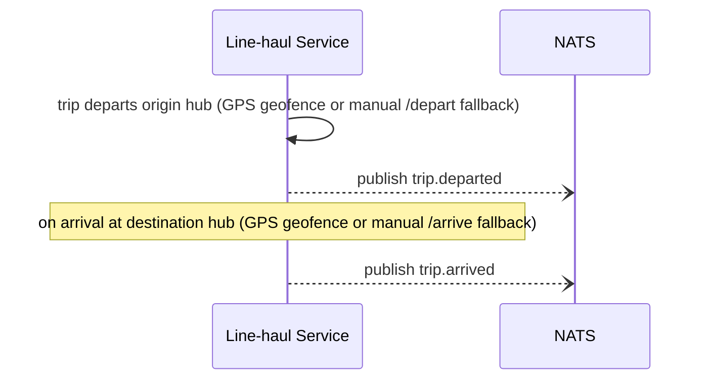
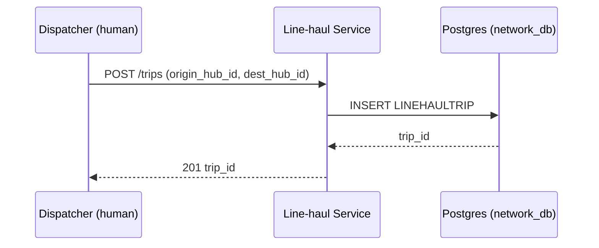

# LLD — Line-haul Service

## Versioning

| Version | Date | Author | Changes |
| :--- | :--- | :--- | :--- |
| v1.0 | 2026-07-03 | Du Nguyen | Initial split from monolithic LLD |

Owns: `LINEHAULTRIP`. Conventions in [00-conventions.md](file:///home/dunguyen/Training/nestjs/shipping-system/docs/lld/00-conventions.md) apply — including `Idempotency-Key` on all three `POST` endpoints below (especially `/depart` and `/arrive`: a retried GPS-triggered call must not double-publish `trip.departed`/`trip.arrived`). This service owns trip **creation and lifecycle** (create/depart/arrive); assigning a driver/truck to an existing trip is Dispatcher's responsibility — see [dispatcher-service.md](file:///home/dunguyen/Training/nestjs/shipping-system/docs/lld/dispatcher-service.md).

## Key Design Decisions

- **REST endpoints are the fallback path, not the primary trigger**: `/depart` and `/arrive` exist for when GPS geofencing is unavailable — the primary trigger is automatic (see [docs/02-HLD.md § Event Triggers](file:///home/dunguyen/Training/nestjs/shipping-system/docs/02-HLD.md)). This is why idempotency matters more here than it might look: manual fallback entry is more retry-prone (human-operated) than an automated sensor event.
- **Creation vs. assignment split across services**: this service only ever writes `LINEHAULTRIP.origin_hub_id`/`dest_hub_id` at creation; it never writes `driver_id`/`truck_id` — that's Dispatcher's write, even though it lands in the same row.

## Use Cases

| UC | Use Case | Actor | Note | Related BR |
| :--- | :--- | :--- | :--- | :--- |
| UC-09 | Create Line-Haul Trip | Dispatcher | Creation part only — assignment is [Dispatcher Service's](file:///home/dunguyen/Training/nestjs/shipping-system/docs/lld/dispatcher-service.md) | — |
| UC-11 | Mark Trip Departed / Arrived (fallback) | Dispatcher | Actor is Dispatcher (human), but implemented here since it writes `LINEHAULTRIP` | — |

## Sequence Diagrams

### 4a. Line-Haul Depart/Arrive Trigger

*(What happens at the destination hub after arrival — the scan + misrouted check — is owned by [hub-service.md](file:///home/dunguyen/Training/nestjs/shipping-system/docs/lld/hub-service.md), Diagram 4b.)*

### 10a. Trip Creation

*(Driver/truck assignment onto this trip, and courier-to-leg assignment, are owned by [dispatcher-service.md](file:///home/dunguyen/Training/nestjs/shipping-system/docs/lld/dispatcher-service.md), Diagram 10b.)*

## API Contracts

### `POST /trips`

| Field | Type | Validation |
| :--- | :--- | :--- |
| `origin_hub_id` | uuid | required, must exist |
| `dest_hub_id` | uuid | required, must exist, ≠ `origin_hub_id` |

**Response `201`**: `{ trip_id }`. **Errors**: `404` hub not found · `400` origin equals destination.

### `POST /trips/{id}/depart` · `POST /trips/{id}/arrive`

No body — **manual fallback only**. Primary trigger is GPS geofencing; these endpoints exist for when GPS integration is unavailable (see [docs/02-HLD.md § Event Triggers](file:///home/dunguyen/Training/nestjs/shipping-system/docs/02-HLD.md)). **Response `200`**: `{ event: "trip.departed"\|"trip.arrived", published_at }`. **Errors**: `404` trip not found · `409` trip already in a terminal state for this transition (e.g. `/arrive` called before `/depart`).

## Database Schema Detail

| Entity | Indexes | Constraints |
| :--- | :--- | :--- |
| `LINEHAULTRIP` | `idx_trip_origin_hub`, `idx_trip_dest_hub`, `idx_trip_driver_id` | PK `id` |
