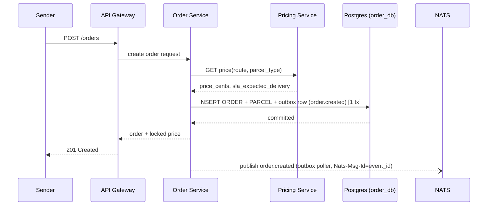
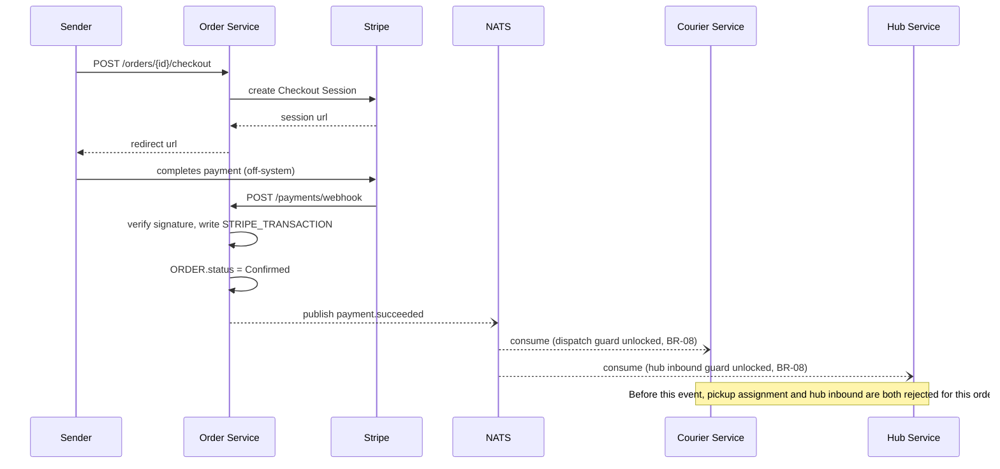

# LLD — Order Service

## Versioning

| Version | Date | Author | Changes |
| :--- | :--- | :--- | :--- |
| v1.0 | 2026-07-03 | Du Nguyen | Initial split from monolithic LLD |

Owns: `CUSTOMER`, `ORDER`, `PARCEL`, `PAYMENT`, `STRIPE_TRANSACTION`. Conventions in [00-conventions.md](file:///home/dunguyen/Training/nestjs/shipping-system/docs/lld/00-conventions.md) apply — including the `Idempotency-Key` header on every `POST` below. See [docs/02-HLD.md](file:///home/dunguyen/Training/nestjs/shipping-system/docs/02-HLD.md) for ownership rationale and event contracts.

## Key Design Decisions

- **Payment gate (BR-08)**: `ORDER.status` only reaches `Confirmed` after `payment.succeeded` (Stripe online checkout). Courier and Hub Service both re-check this gate independently before accepting pickup/inbound.
- **Price/ETA immutability**: locked at creation (BR-01); there is no `PATCH /orders/{id}` — any post-creation adjustment (e.g. weight discrepancy) is a downstream reconciliation, not an edit to this record.
- **Outbox on create only**: `POST /orders` is the only endpoint in this service backed by the transactional outbox (see [docs/02-HLD.md § Idempotency and outbox mechanics](file:///home/dunguyen/Training/nestjs/shipping-system/docs/02-HLD.md)). The webhook handler updates `ORDER.status` directly before publishing `payment.succeeded` — this is a documented accepted risk (see [docs/02-HLD.md § Accepted MVP risk](file:///home/dunguyen/Training/nestjs/shipping-system/docs/02-HLD.md)): lower blast radius than the Courier/Hub case (no missing audit entry, since `ORDER.status` itself is already correct on a lost publish), but downstream consumers (Tracking, Notification) would miss the transition.

## Use Cases

| UC | Use Case | Actor | Trigger | Main Outcome | Related BR |
| :--- | :--- | :--- | :--- | :--- | :--- |
| UC-01 | Get Rate Quote | Sender | Sender previews a route/parcel before committing | Price preview returned, nothing persisted | — |
| UC-02 | Create Order | Sender | Sender submits sender/recipient/parcel details | `ORDER` + `PARCEL` created, price + ETA locked | BR-01 |
| UC-03 | Complete Prepaid Payment | Sender | Sender chooses prepaid at checkout | Stripe Checkout session created, later confirmed via webhook | BR-08 |

### UC-02 + UC-03 — Create Order & Complete Prepaid Payment

- **Preconditions**: Sender has valid addresses for both sender and recipient; at least one parcel with weight/dimensions.
- **Postconditions (success)**: `ORDER` + `PARCEL` rows exist; price locked; `ORDER.status = Confirmed` only after `payment.succeeded`.
- **Main flow**:
  1. Sender calls `GET /orders/{id}/quote` (optional) to preview price.
  2. Sender calls `POST /orders` → this service calls Pricing synchronously → price + ETA locked → `order.created` published (outbox-backed).
  3. Sender calls `POST /orders/{id}/checkout` → Stripe Checkout session returned.
  4. Stripe posts to `POST /payments/webhook` on completion → `payment.succeeded` published → `ORDER.status = Confirmed`.
- **Exception flow**: payment abandoned/failed → `ORDER.status` stays below `Confirmed` indefinitely; BR-08 blocks all downstream dispatch/inbound actions. No automatic cancellation is defined for this slice (see Known Open Item below).

## Sequence Diagrams

### 1. Order Creation & Pricing



### 2. Prepaid Payment via Stripe



### 8. Order Status Projection (Debounced, Per-Order Serialized)

```mermaid
sequenceDiagram
    participant Tracking as Tracking Service
    participant NATS as "NATS (orders.status.order_id)"
    participant Order as Order Projection Consumer
    participant Redis

    Tracking->>Tracking: append any status-relevant scan event
    Tracking--)NATS: publish recompute trigger (order_id only, no payload)
    Note over NATS: JetStream guarantees in-order, serial delivery per order_id subject
    NATS--)Order: consume trigger
    Order->>Order: (re)start debounce timer for this order_id (~a few hundred ms)
    Note over Order: additional triggers for the same order reset the timer instead of queuing a second recompute
    Order->>Order: timer fires -> read latest state of every parcel under the order
    Order->>Order: ORDER.status = least-advanced parcel rank (BR-05)
    Order->>Redis: write-through ORDER.status
    Note over Redis: reads served from cache; fall back to Postgres on miss
```

*(Full producer side of this flow — the Tracking service append that kicks it off — is in [tracking-service.md](file:///home/dunguyen/Training/nestjs/shipping-system/docs/lld/tracking-service.md).)*

## API Contracts

### `POST /orders`

| Field | Type | Validation |
| :--- | :--- | :--- |
| `sender` | object `{ name, phone, address, region_code }` | all required, non-empty strings |
| `recipient` | object `{ name, phone, address, region_code }` | all required, non-empty strings |
| `parcels[]` | array of `{ declared_weight_grams, type }` | min 1 item; `declared_weight_grams` int > 0; `type` ∈ `parcel, pallet` |
| `payment_type` | enum | `PREPAID_STRIPE` |

**Response `201`**: `{ order_id, price_cents, expected_delivery_at, status }`
**Errors**: `400` missing/invalid fields · `404` unresolvable route (no `RATECARD` for the zone pair, via sync call to Pricing) · any later `PATCH /orders/{id}` is `405 Method Not Allowed` by design — price is locked (BR-01), not editable.

**Side effect**: writes `ORDER` + `PARCEL` + an outbox row (`event_type=order.created`) in one DB transaction (see [docs/02-HLD.md § Idempotency and outbox mechanics](file:///home/dunguyen/Training/nestjs/shipping-system/docs/02-HLD.md)).

### `GET /orders/{id}/quote`

Query: `origin_zone_id`, `dest_zone_id`, `parcel_type`. **Response `200`**: `{ price_cents, sla_expected_delivery }` (proxied from Pricing Service synchronously). **Errors**: `404` no matching `RATECARD`.

### `POST /orders/{id}/checkout`

No body. **Response `200`**: `{ checkout_url, stripe_session_id }`. **Errors**: `404` order not found · `409` order already `Confirmed` · `422 BR-08` order already has a `PAYMENT` row in a non-`Unpaid` state.

### `POST /payments/webhook`

Stripe-signed payload (not a user-facing DTO). Verify `Stripe-Signature` header against the raw body **before** parsing JSON. **Response `200`** (always, once signature + idempotency check pass, per Stripe's retry contract). **Errors**: `400` signature verification failed. A duplicate `event.id` already processed returns `200` (not an error) — ack without reprocessing.

**Side effect**: writes `STRIPE_TRANSACTION`, sets `ORDER.status = Confirmed`, publishes `payment.succeeded`.

## Database Schema Detail

| Entity | Indexes | Constraints |
| :--- | :--- | :--- |
| `CUSTOMER` | — | PK `id` |
| `ORDER` | `idx_order_sender_id`, `idx_order_recipient_id`, `idx_order_status` (for projection sweeps) | PK `id` · FK `sender_id`/`recipient_id` → `CUSTOMER.id` (same schema) |
| `PARCEL` | `idx_parcel_order_id`, `idx_parcel_route_id` | PK `id` · FK `order_id` → `ORDER.id` (same schema) · CHECK `declared_weight_grams > 0` |
| `PAYMENT` | `idx_payment_order_id` | PK `id` · UNIQUE `order_id` (one payment per order) |
| `STRIPE_TRANSACTION` | `idx_stripe_txn_payment_id` | PK `id` · UNIQUE `stripe_intent_id` (webhook idempotency) |

## Known Open Item

`POST /orders/{id}/checkout` has no handling yet for a prepaid order whose payment is abandoned or permanently fails — the order stays below `Confirmed` indefinitely with no auto-cancel. Flagged during LLD write-up; not yet assigned to a phase.
