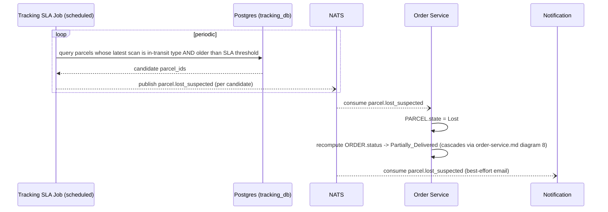

# LLD — Tracking Service

## Versioning

| Version | Date | Author | Changes |
| :--- | :--- | :--- | :--- |
| v1.0 | 2026-07-03 | Du Nguyen | Initial split from monolithic LLD |

Owns: `SCANEVENT`. Conventions in [00-conventions.md](file:///home/dunguyen/Training/nestjs/shipping-system/docs/lld/00-conventions.md) apply. Tracking is the **sole writer** of `SCANEVENT` — every other service publishes a NATS event and Tracking appends the row; no other service ever writes this table directly. Its only REST endpoint is a read, so `Idempotency-Key` doesn't apply.

## Key Design Decisions

- **Sole writer, append-only**: enforced at the DB role level (no `UPDATE`/`DELETE` grant), not just by convention — see BR-03.
- **Cache boundary**: `ORDER.status` is served from Redis (write-through by Order's projection consumer); the per-parcel scan timeline always reads Postgres directly — deliberately not cached, since it's high-cardinality and low-reuse per request.
- **Passive detection lives here, not in Order**: the lost-parcel SLA sweep runs inside Tracking because it already owns `SCANEVENT` and needs no cross-service query to find candidates.

## Use Cases

| UC | Use Case | Actor | Trigger | Main Outcome | Related BR |
| :--- | :--- | :--- | :--- | :--- | :--- |
| UC-04 | Track Parcel | Recipient | Recipient opens the tracking link | Aggregated scan timeline across all parcels in the order | — |
| UC-15 | Detect Lost Parcel (passive) | System | No scan past SLA threshold | `parcel.lost_suspected` published | — |

UC-04 (`GET /tracking/{tracking_id}`) has no dedicated sequence diagram — it's a plain synchronous read, not an event flow.

## Sequence Diagrams

### 9. Passive Lost-Parcel Detection

This service is also the **producer** side of **Diagram 8 — Order Status Projection** (it appends the scan event and publishes the recompute trigger) — the consumer/recompute side of that flow is owned by [order-service.md](file:///home/dunguyen/Training/nestjs/shipping-system/docs/lld/order-service.md).

## API Contracts

### `GET /tracking/{tracking_id}`

`{tracking_id}` = `ORDER.id`. **Response `200`**: `{ order_id, status, parcels: [{ parcel_id, state, timeline: [{ event_type, created_at, hub_id?, courier_id?, linehaul_trip_id? }] }] }`. **Errors**: `404` unknown order id.

Reads are served from the `ORDER.status` Redis cache (write-through, populated by the Order Service's projection consumer) for the `status` field; the per-parcel `timeline` array always reads from Postgres directly (not cached — high cardinality, low reuse per request).

## Database Schema Detail

| Entity | Indexes | Constraints |
| :--- | :--- | :--- |
| `SCANEVENT` | `idx_scanevent_parcel_id_created_at` (composite, `created_at DESC` — powers the tracking timeline query) · `idx_scanevent_linehaul_trip_id` (powers batch misrouted re-route lookups, see [docs/02-HLD.md § Misrouted handling](file:///home/dunguyen/Training/nestjs/shipping-system/docs/02-HLD.md)) | PK `id` · append-only: the DB role used by this service has no `UPDATE`/`DELETE` grant on this table (BR-03) |

## Background Job

The passive lost-parcel detection job (see Diagram 9 above) runs on a schedule inside this service — periodic query: latest scan per parcel is an in-transit `event_type`, older than the SLA threshold, no subsequent `ARRIVED_AT_HUB`/`DELIVERED`. Powered by the same composite index above.
